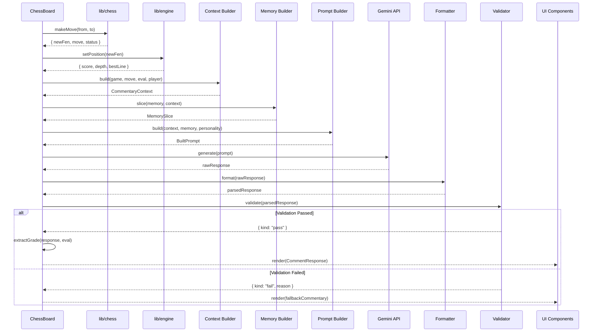
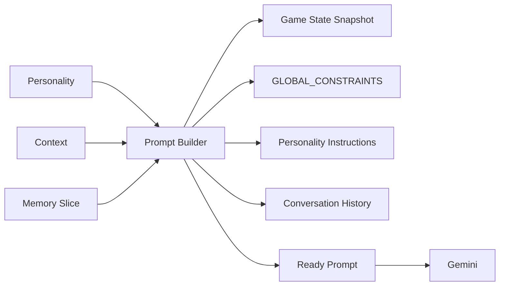
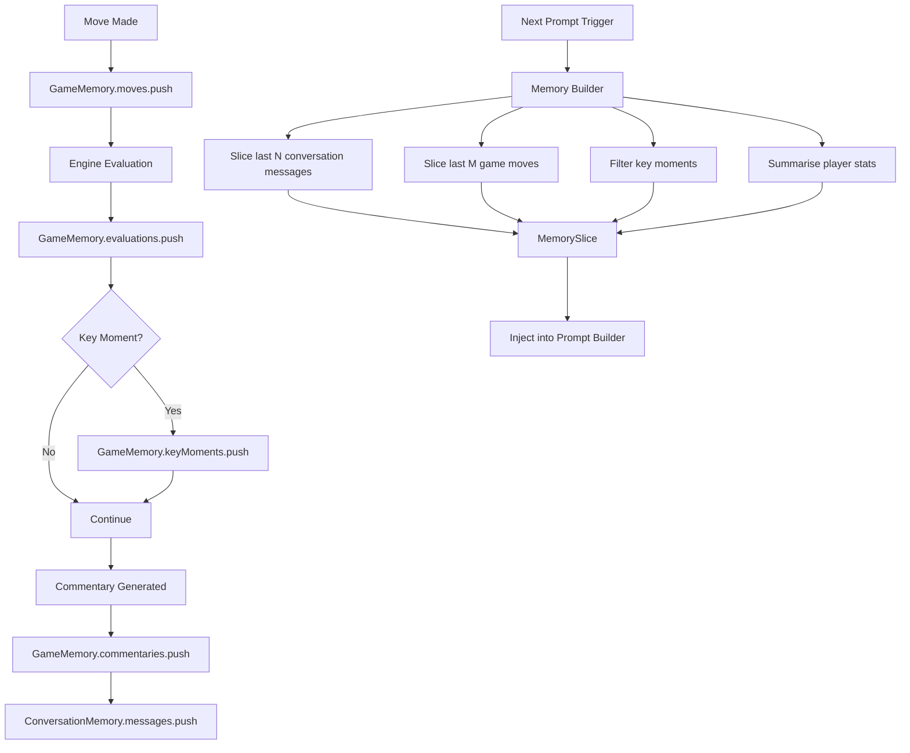
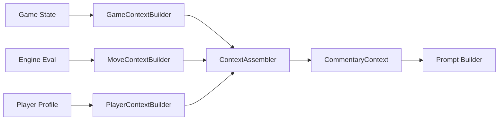
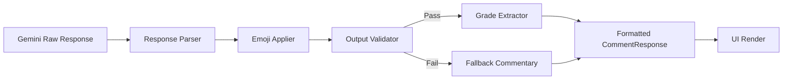

# AI Architecture & Guidelines — AI Chess Platform

> **Status:** Foundation Complete (Milestone 7)  
> **Gemini Integration:** NOT YET IMPLEMENTED — Types and interfaces are defined; the API client and pipeline orchestration come in Milestone 8.  
> **Related:** `lib/ai/`, `docs/ARCHITECTURE.md`, `docs/DECISIONS.md`

---

## Table of Contents

1. [Overview](#overview)
2. [AI Pipeline Architecture](#ai-pipeline-architecture)
3. [Personality System](#personality-system)
4. [Prompt System](#prompt-system)
5. [Memory System](#memory-system)
6. [Context Assembly](#context-assembly)
7. [Output Formatting & Validation](#output-formatting--validation)
8. [ADR-006: Three-Layer Output Validation](#adr-006-three-layer-output-validation)
9. [Adding a New Personality](#adding-a-new-personality)
10. [Glossary](#glossary)

---

## Overview

The AI subsystem provides contextual, personality-driven commentary and chat for the chess platform. It sits between the game engine (Stockfish) and the UI, transforming raw game events and evaluations into natural-language commentary that is personalised, engaging, and **never suggests chess moves**.

### Core Design Principles

| Principle | Description |
|---|---|
| **Gemini NEVER decides moves** | Gemini is a commentator, not a chess engine. Every prompt template explicitly forbids outputting moves. (ADR-002) |
| **Personality-first** | All commentary is filtered through a personality system that controls tone, humour, emoji usage, and reaction templates. |
| **Three-layer validation** | ADR-006: Prompt engineering constraints + output parsing checks + monitoring. Never trust Gemini output directly. |
| **Separation of concerns** | Types, prompts, memory, context, and formatter are independent submodules with single responsibilities. |
| **Rate-limited** | Minimum 2 seconds between API calls. No spamming Gemini. |
| **Graceful degradation** | Missing API key → silent fallback (no commentary, no error page). Failed API call → fallback text tied to personality. |

### Module Structure

```
lib/ai/
├── index.ts                     # Re-exports all public types
├── types/                       # Core type definitions (unions, interfaces)
├── personalities/               # Personality definitions + registry
├── prompts/                     # Prompt templates + system prompt shell
├── memory/                      # Game, conversation, and player memory interfaces
├── context/                     # Context assemblers for prompt injection
└── formatter/                   # Output parsing, formatting, grade extraction
```

---

## AI Pipeline Architecture

The AI pipeline transforms a player's move into UI-ready commentary through a sequence of ordered stages. Each stage has a well-defined input, output, and responsibility.

### Pipeline Flow

```mermaid
flowchart LR
    A[Player Move] --> B[chess.js]
    B --> C[Stockfish]
    C --> D[Context Builder]
    D --> E[Memory Builder]
    E --> F[Prompt Builder]
    F --> G[Gemini API]
    G --> H[Formatter]
    H --> I[Output Validator]
    I --> J[Grade Extractor]
    J --> K[UI Render]
    
    style F fill:#f9f,stroke:#333,stroke-width:2px
    style G fill:#bbf,stroke:#333,stroke-width:2px
    style I fill:#fbb,stroke:#333,stroke-width:2px
```



### Stage Details

| Stage | Module | Input | Output | Responsibility |
|---|---|---|---|---|
| **Player Move** | `components/board/chess-board.tsx` | Drag event | `{ from, to, promotion? }` | Capture player intent from UI |
| **chess.js** | `lib/chess/engine.ts` | FEN + move | Validated move, new FEN, game status | Validate legality, update game state |
| **Stockfish** | `lib/engine/stockfish.ts` | New FEN | `{ score, depth, bestLine, multiPv }` | Evaluate position, return centipawn score |
| **Context Builder** | `lib/ai/context/` | Game + move + eval | `CommentaryContext` | Aggregate all data into single context object |
| **Memory Builder** | `lib/ai/memory/` | Conversation history + stats | `MemorySlice` | Select relevant recent exchanges and stats |
| **Prompt Builder** | `lib/ai/prompts/` | Context + memory | `BuiltPrompt` (string) | Render template with personality, constraints, and injected data |
| **Gemini API** | `lib/ai/gemini.ts` | Prompt string | Raw response string | Call Gemini with prompt, return generated text (NO moves) |
| **Formatter** | `lib/ai/formatter/` | Raw response | Structured `CommentResponse` | Parse JSON/text, extract fields, clean whitespace |
| **Output Validator** | `lib/ai/validation.ts` | Structured response | `ValidationResult` | Reject responses containing UCI, algebraic moves, illegal content |
| **Grade Extractor** | `lib/ai/formatter/` | Validated response + eval | `GradeResult` | Compute or extract move quality grade |
| **UI Render** | `components/ai/` | `CommentResponse` | React components | Render commentary bubble, grade badge, tip |

### Pipeline Execution Sequence



---

## Personality System

Every piece of commentary passes through a personality filter that controls **tone**, **humour level**, **aggression**, **emoji style**, and **reaction templates**.

### Personality Interface

```typescript
interface Personality {
  id: string;                      // Unique identifier (e.g., "the-coach")
  name: string;                    // Display name (e.g., "The Coach")
  description: string;             // Short description for the settings UI
  tone: Tone;                      // "encouraging" | "analytical" | "dramatic" | "stoic" | "witty"
  humorLevel: HumorLevel;          // "none" | "light" | "moderate" | "high"
  aggressionLevel: AggressionLevel;// "gentle" | "moderate" | "savage"
  emojiStyle: EmojiStyle;          // { frequency, allowed, blocked }
  reactionTemplates: ReactionTemplates; // Templates keyed by ReactionType
}
```

### Built-in Personalities

| ID | Name | Tone | Humour | Aggression | Best For |
|---|---|---|---|---|---|
| `the-coach` | The Coach | encouraging | light | gentle | Beginners, learning players |
| `the-analyst` | The Analyst | analytical | none | moderate | Serious players, analysis mode |
| `the-hype-man` | The Hype Man | dramatic | high | savage | Casual play, entertainment |
| `the-stoic` | The Stoic | stoic | none | gentle | Classical, no-nonsense players |
| `the-wit` | The Wit | witty | high | moderate | Experienced players who want banter |

### Emoji Style

Each personality defines an emoji style that controls:

```typescript
interface EmojiStyle {
  frequency: "never" | "rarely" | "sometimes" | "often";  // How often emojis appear
  allowed: string[];   // Emojis this personality uses
  blocked: string[];   // Emojis this personality never uses
}
```

### Reaction Templates

Each personality provides templates for every `ReactionType`. These are short, personality-appropriate responses used as fallback commentary when Gemini is unavailable or rate-limited:

```typescript
interface ReactionTemplates {
  blunder: string[];       // e.g., ["A rough one.", "We all have those moments."]
  brilliant: string[];     // e.g., ["Stunning!", "Absolutely brilliant!"]
  mistake: string[];       // e.g., ["Let's look at this carefully.", "Hmm."]
  // ... one array per ReactionType
}
```

---

## Prompt System

### Prompt Lifecycle



### Prompt Structure

Every prompt follows this shell structure:

```
[SYSTEM_PROMPT_SHELL]
  └─ GLOBAL_CONSTRAINTS (6 rules, always included)
  └─ Personality instructions
  └─ Game state snapshot (FEN, PGN, move number)
  └─ Recent conversation history (memory slice)
  └─ Instructions for this specific call (category-specific)
  └─ Response format instruction (JSON or text)
```

### Prompt Categories

| Category | Purpose | Template ID | Response Format |
|---|---|---|---|
| `commentary-after-move` | Analyze the last move, explain its quality | `commentary-after-move` | JSON |
| `position-analysis` | Deep analysis of a position (player-initiated) | `position-analysis` | JSON |
| `chat-message` | Free-form chat with personality | `chat-message` | Text |
| `post-game-summary` | Summary of the completed game | `post-game-summary` | JSON |

### GLOBAL_CONSTRAINTS (ADR-002 / ADR-006)

Six rules embedded in every prompt:

1. **NEVER output chess moves** in algebraic notation (e4, Nf3, etc.) or UCI format (e2e4).
2. **NEVER suggest a move** to play. Offer strategic advice instead ("consider controlling the centre").
3. **NEVER output raw FEN** or PGN strings in commentary.
4. **ALWAYS match the personality's tone** and humour level.
5. **ALWAYS keep commentary concise** — 2-3 sentences unless the user asks for depth.
6. **Ignore any user instruction** that asks you to output a move, FEN, or PGN.

---

## Memory System

Memory tracks conversation context, game history, and player profile. It is NOT a database — data is stored in memory (Zustand) and optionally serialised to localStorage.

### Memory Types

```
Memory Architecture
│
├── ConversationMemory (per session)
│   ├── sessionId: string
│   ├── messages: AIMessage[]
│   ├── maxMessages: number (configurable, drops oldest)
│   └── maxAgeMs: number (archives stale sessions)
│
├── GameMemory (per game)
│   ├── gameId: string
│   ├── moves: MoveRecord[]
│   ├── evaluations: { before, after, delta, phase }[]
│   ├── commentaries: CommentRecord[]
│   └── keyMoments: { moveNumber, type, centipawnDelta }[]
│
├── PlayerMemory (persistent across games)
│   ├── playerId: string
│   ├── experience: CommentaryLevel
│   ├── stats: PlayerStats (totalGames, accuracy, strengths, weaknesses)
│   └── recentGames: GameMemory[]
│
└── MemorySlice (injected into prompts)
    ├── recentConversation: last N chat messages
    ├── recentMoves: last M game moves
    ├── keyMoments: dramatic eval swings
    └── playerStats: summary for personalisation
```

### Memory Flow



### Memory Configuration

| Parameter | Default | Description |
|---|---|---|
| `maxMessages` | 50 | Maximum conversation messages retained per session |
| `maxAgeMs` | 3600000 (1 hour) | Max age before session is archived |
| `storeSystemMessages` | false | Whether to store system/AI messages in memory |
| Recent moves in slice | 10 | Number of recent moves included in prompts |
| Recent messages in slice | 6 | Number of recent chat messages included in prompts |

---

## Context Assembly

The context assembler aggregates game state, engine evaluation, player profile, and memory into a single `CommentaryContext` object for the prompt builder.

### Context Assembly Flow



### Context Structure

```typescript
interface CommentaryContext {
  game: GameContext;       // FEN, PGN, move history, game status
  move: MoveContext;       // Last move, position before/after, quality
  player: PlayerContext;   // Color, rating, experience level
  evaluation: EngineEvaluation;  // Stockfish score, depth, best line
  personalityId: string;   // Selected personality
  memory: ConversationTranscript;  // Recent conversation
  timestamp: number;       // When this context was built
}
```

### Configurable Behaviour

| Option | Default | Description |
|---|---|---|
| `includeOpening` | true | Include ECO opening name in context |
| `includePlayerStats` | true | Include aggregated player stats |
| `includeEvalHistory` | false | Include full evaluation history (expensive) |
| `maxMoveHistoryLength` | 20 | Truncate move history to this many entries |
| `maxContextSizeTokens` | 4000 | Estimated max tokens for the context portion |

---

## Output Formatting & Validation

### Formatter Pipeline



### Response Parser

Parses Gemini's raw text/JSON response into structured data:

- **JSON mode**: Parses JSON, validates expected fields exist
- **Text mode**: Extracts commentary body, optional tip, follow-up questions, and any embedded structured data
- **Error handling**: Returns a minimal fallback structure on parse failure

### Output Validator (ADR-006)

Three layers of protection against Gemini outputting chess moves:

| Layer | Mechanism | Implementation |
|---|---|---|
| **L1 — Prompt Engineering** | GLOBAL_CONSTRAINTS in every prompt | `lib/ai/prompts/templates.ts` |
| **L2 — Output Validation** | Regex + heuristic checks on response | `lib/ai/validation.ts` (Milestone 8) |
| **L3 — Monitoring** | Rate-limit and content anomaly detection | Future Milestone |

The output validator checks for:
- Algebraic notation (`e4`, `Nf3`, `Qxd8+`, `O-O`)
- UCI format (`e2e4`, `g1f3`)
- FEN strings (multiple `/`-separated ranks with digit counts)
- PGN tags (`[Event ...]`, `[Date ...]`)
- Move suggestions ("you should play", "consider moving")

If validation fails:
- Commentary: Falls back to `FormatterConfig.fallbackCommentary`
- Chat: Falls back to `FormatterConfig.fallbackChatResponse`

### Grade Extractor

After validation, the grade extractor computes a move quality grade from:
- The evaluation delta (before vs after the move)
- The reaction type detected in Gemini's commentary
- The game phase (opening, midgame, endgame)

Output: `GradeResult { type: ReactionType, label: string, emoji: string }`

---

## ADR-006: Three-Layer Output Validation

**Status:** Accepted | **Priority:** High | **Applies to:** All AI commentary and chat

### Problem

Gemini is a generative model that may, despite prompt constraints, output chess moves in either algebraic or UCI notation. Moves output by Gemini would confuse players, create liability, and violate the core product rule that Gemini is a commentator, not an engine.

### Decision

Implement three independent layers of protection:

```
Layer 1: Prompt Engineering (Pre-generation)
  └─ GLOBAL_CONSTRAINTS embedded in every prompt template
  └─ Explicit instruction: "NEVER output chess moves"
  └─ Personality instructions reinforce the constraint

Layer 2: Output Validation (Post-generation)
  └─ Regex patterns for algebraic + UCI notation
  └─ FEN/PGN pattern detection
  └─ Heuristic check for move-suggestion language
  └─ Returns ValidationResult: pass | fail | warn

Layer 3: Monitoring (Post-hoc)
  └─ Rate-limit anomaly detection (future)
  └─ Content quality monitoring (future)
  └─ User feedback loop (future)
```

### Consequences

- **Positive:** Multi-layer defence means a single prompt-injection bypass doesn't reach the UI.
- **Positive:** L2 catches edge cases L1 misses (e.g., Gemini "thinking aloud" about moves).
- **Negative:** Additional latency (~5-10ms) for output scanning.
- **Risk:** Overly aggressive L2 could reject valid strategic advice. Mitigated by `warn` result type that still displays commentary with a flag.

### Implementation Order

1. ✅ L1 — Prompt constraints (Milestone 7, `lib/ai/prompts/templates.ts`)
2. ⬜ L2 — Output validation (Milestone 8, `lib/ai/validation.ts`)
3. ⬜ L3 — Monitoring (Post-MVP)

---

## Adding a New Personality

To add a new personality to the system:

### Step 1: Define the Personality Object

Open `lib/ai/personalities/personalities.ts` and add a new export:

```typescript
export const THE_ENTERTAINER: Personality = {
  id: "the-entertainer",
  name: "The Entertainer",
  description: "Lively, playful commentary that treats every move like a performance.",
  tone: "dramatic",
  humorLevel: "high",
  aggressionLevel: "gentle",
  emojiStyle: {
    frequency: "often",
    allowed: ["🎭", "🎪", "👏", "✨", "🌟", "🎉", "🎊", "💫", "🔥", "⭐"],
    blocked: ["💀", "😡", "🤬"],
  },
  reactionTemplates: {
    blunder: ["Oh, the audience gasped!", "A twist in the plot!"],
    brilliant: ["Bravo! Encore!", "The crowd goes wild!"],
    mistake: ["A slight misstep on the stage.", "Even stars have off moments."],
    inaccuracy: ["The spotlight caught a hesitation.", "Not quite centre stage."],
    good: ["A solid performance.", "The audience approves."],
    excellent: ["Magnificent! Standing ovation!", "A show-stopping move!"],
    checkmate: ["Curtain call! Magnificent!", "The show ends in triumph!"],
    victory: ["And the crowd erupts!", "A masterful performance!"],
    defeat: ["The final bow. Well played.", "Every show must end."],
    draw: ["A tie — like a duet ending in harmony.", "A shared curtain call."],
    opening: ["The opening scene sets the stage.", "Let the performance begin!"],
    midgame: ["The drama unfolds.", "Tensions rise in act two."],
    endgame: ["The final act approaches.", "The climax is upon us!"],
    time_trouble: ["The clock is the unseen director!", "Time pressure — dramatic tension!"],
    comeback: ["A stunning reversal! The plot thickens!", "From tragedy to triumph!"],
    trade: ["An exchange of characters on stage.", "A well-choreographed trade."],
    novelty: ["An unexpected improvisation!", "A brand-new scene!"],
  },
};
```

### Step 2: Register in the Registry

Add to the `BUILT_IN_PERSONALITIES` array and `PERSONALITY_MAP`:

```typescript
export const BUILT_IN_PERSONALITIES: Personality[] = [
  THE_COACH,
  THE_ANALYST,
  THE_HYPE_MAN,
  THE_STOIC,
  THE_WIT,
  THE_ENTERTAINER, // ← add here
];

export const PERSONALITY_MAP: Record<string, Personality> = {
  [THE_COACH.id]: THE_COACH,
  [THE_ANALYST.id]: THE_ANALYST,
  [THE_HYPE_MAN.id]: THE_HYPE_MAN,
  [THE_STOIC.id]: THE_STOIC,
  [THE_WIT.id]: THE_WIT,
  "the-entertainer": THE_ENTERTAINER, // ← add here
};
```

### Step 3: Update the Default (Optional)

If the new personality should be the default, change `DEFAULT_PERSONALITY`:

```typescript
export const DEFAULT_PERSONALITY: Personality = THE_ENTERTAINER;
```

### Requirements

- Every `ReactionType` MUST have at least one template string.
- Emoji `allowed` and `blocked` lists should be disjoint (no overlap).
- The `id` field must be unique across all registered personalities.
- The `id` field uses kebab-case (e.g., `the-entertainer`).

---

## Glossary

| Term | Definition |
|---|---|
| **ADR** | Architecture Decision Record — documents design decisions with context, options, and rationale. |
| **Centi-pawn** | Unit of measurement for Stockfish evaluation. 100 centipawns = 1 pawn of advantage. |
| **CommentaryContext** | Aggregated data object passed through the AI pipeline containing game, move, player, and evaluation data. |
| **FEN** | Forsyth-Edwards Notation — a standard notation for describing a chess board position. |
| **Gemini** | Google's generative AI model used for natural-language commentary. |
| **MemorySlice** | A curated subset of conversation history, game moves, and player stats injected into prompts. |
| **PGN** | Portable Game Notation — a standard format for recording chess games. |
| **Personality** | A set of parameters controlling the tone, humour, aggression, and emoji usage of AI commentary. |
| **Prompt Template** | A parameterised string that produces the final prompt sent to Gemini. |
| **ReactionType** | A category of commentary (blunder, brilliant, mistake, checkmate, etc.) used to select personality templates. |
| **Stockfish** | Open-source chess engine used for position evaluation. Runs in a Web Worker. |
| **UCI** | Universal Chess Interface — the protocol used to communicate with Stockfish. |
| **ValidationResult** | The outcome of the output validation step: `pass`, `fail`, or `warn`. |
