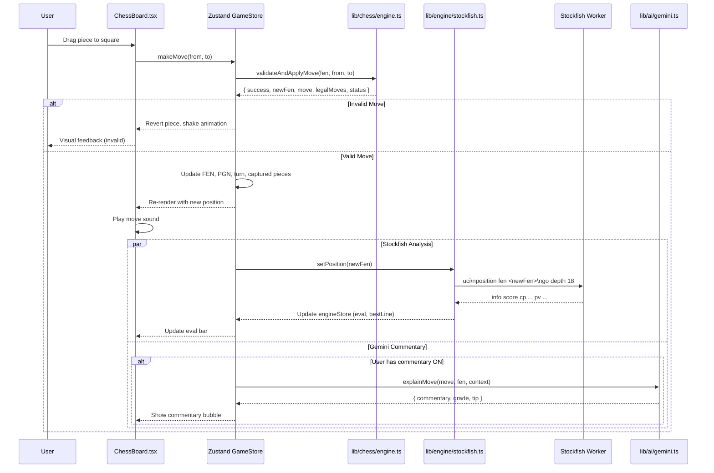
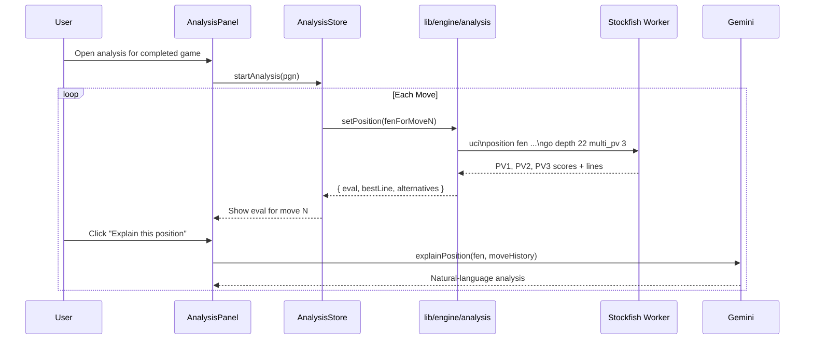
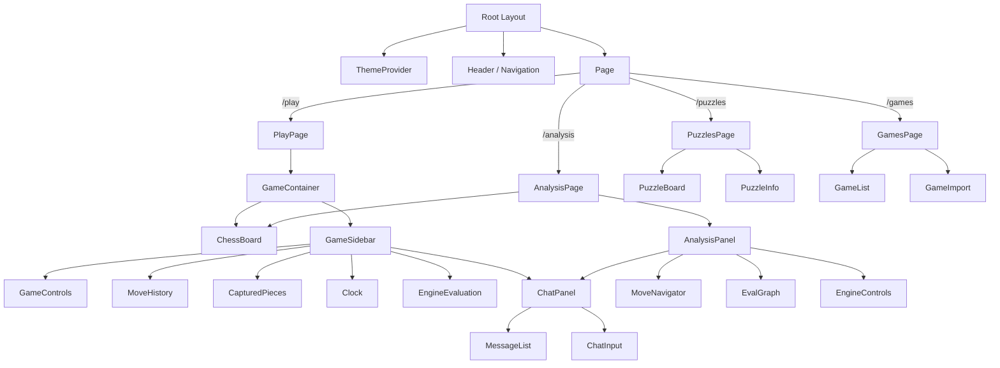

# System Architecture — AI Chess Platform

## High-Level Architecture

```
┌─────────────────────────────────────────────────────────────────────┐
│                         Browser (Client)                           │
│                                                                     │
│  ┌───────────────────┐  ┌────────────────┐  ┌──────────────────┐  │
│  │   Next.js App      │  │  Zustand       │  │  UI Layer        │  │
│  │   (App Router)     │  │  Stores        │  │  (React 19)      │  │
│  │                    │  │                │  │                  │  │
│  │  /play             │  │  gameStore     │  │  ChessBoard.tsx  │  │
│  │  /analysis         │  │  engineStore   │  │  GameControls    │  │
│  │  /puzzles          │  │  settingsStore │  │  ChatPanel       │  │
│  │  /games            │  │  analysisStore │  │  EvalBar         │  │
│  └───────────────────┘  └───────┬────────┘  └──────────────────┘  │
│                                  │                                   │
│  ┌───────────────────────────────┴───────────────────────────────┐  │
│  │                    Business Logic Layer                       │  │
│  │                                                               │  │
│  │  ┌────────────────────┐  ┌──────────────────┐                 │  │
│  │  │  lib/chess/        │  │  lib/ai/         │                 │  │
│  │  │  (chess.js wrapper)│  │  (Gemini client) │                 │  │
│  │  └────────┬───────────┘  └────────┬─────────┘                 │  │
│  │           │                       │                            │  │
│  │  ┌────────┴───────────────────────┴─────────┐                  │  │
│  │  │  lib/engine/ (Stockfish Bridge)          │                  │  │
│  │  │  ┌────────────────────────────────────┐  │                  │  │
│  │  │  │  Web Worker (nmrugg/stockfish.js)   │  │                  │  │
│  │  │  │  Separate thread, no DOM access    │  │                  │  │
│  │  │  └────────────────────────────────────┘  │                  │  │
│  │  └──────────────────────────────────────────┘                  │  │
│  └───────────────────────────────────────────────────────────────┘  │
└─────────────────────────────────────────────────────────────────────┘
```

## Module Architecture

```
┌──────────────┐     ┌──────────────────┐     ┌──────────────────┐
│   React      │────►│   Zustand Store  │────►│   lib/chess/     │
│   Components │     │   (game state)   │     │   (chess.js)     │
│              │     │                  │     │                  │
│  User drags  │     │  - FEN           │     │  - makeMove()    │
│  piece →     │     │  - PGN           │     │  - getLegalMoves │
│  square      │     │  - move history  │     │  - isCheckmate() │
│              │     │  - selected sq   │     │  - loadPGN()     │
└──────────────┘     │  - game status   │     └──────────────────┘
                     └──────────────────┘
                             │
                             ▼
                     ┌──────────────────┐     ┌──────────────────┐
                     │  lib/engine/     │────►│  Stockfish       │
                     │  (bridge)        │     │  (Web Worker)    │
                     │                  │     │                  │
                     │  - setPosition() │     │  UCI protocol    │
                     │  - goSearch()    │     │  eval + bestline │
                     │  - stop()        │     │  analysis        │
                     │  - onEval()      │     │  multi-PV        │
                     └──────────────────┘     └──────────────────┘
                     │
                     ▼
                     ┌──────────────────┐     ┌──────────────────┐
                     │  lib/ai/         │────►│  Gemini API      │
                     │  (commentary)    │     │                  │
                     │                  │     │  Natural lang    │
                     │  - analyzeGame() │     │  analysis        │
                     │  - explainMove() │     │  NO move output  │
                     │  - chat()        │     │  NO engine calls │
                     └──────────────────┘     └──────────────────┘
```

## Data Flow — Player Makes a Move



## Data Flow — Game Analysis Session



## Component Tree



## Web Worker Architecture

Stockfish runs in a dedicated Web Worker (nmrugg/stockfish.js) to avoid blocking the main thread. The Worker script auto-detects it's in a Worker context, fetches the WASM binary from the same directory, and initializes Stockfish. Communication is via raw UCI text strings over `postMessage`/`onmessage`.

```
Main Thread                          Web Worker (nmrugg/stockfish.js)
────────────                         ──────────────────────────────
                                     Worker created from
                                     /stockfish/stockfish.js
                                     Auto-fetches stockfish.wasm
                                     Initializes Stockfish engine
                                     Sends "uciok" when ready

lib/engine/stockfish.ts               Worker
  │                                     │
  ├── worker.postMessage("uci")───────►│  Initialize UCI mode
  ├── worker.postMessage("isready")───►│  Check if ready → "readyok"
  ├── worker.postMessage("position    │  Set board position
  │    fen rnbqkbnr/pppppppp/8/...")──►│
  ├── worker.postMessage("go depth    │  Start search at depth 18
  │    18")───────────────────────────►│
  │                                     │
  │                                     ├── info depth 1 score cp ...
  │                                     ├── info depth 2 score cp ...
  │                                     │  (every node evaluated)
  │  onmessage ◄───────────────────────┤
  │  ├── Parse "info depth 18 score    │
  │  │    cp 45 pv e2e4 e7e5 ..."      │
  │  ├── Update engineStore.eval       │
  │  └── Re-render eval bar            │
  │                                     │
  ├── worker.postMessage("stop")──────►│  Halt search
  │                                     └── bestmove e2e4
  │
  User makes move ────────────────────►  New position → repeat
```

## AI Pipeline Architecture

The AI subsystem transforms game events into personality-driven commentary through a pipeline of six independent submodules, plus a validation and pipeline layer.

```
lib/ai/
│
├── types/           Core type definitions (unions, contexts, messages, responses)
├── personalities/   Commentary personality definitions + registry (5 built-in)
├── prompts/         Prompt templates with ADR-002/ADR-006 constraints
├── memory/          Conversation, game, and player memory interfaces
├── context/         Context assemblers → CommentaryContext for prompt builder
├── validation/      Response schema validation, injection detection, sanitization (Layer 2)
├── pipeline/        Response processing pipeline orchestrator
└── formatter/       Output formatting, parsing, grade extraction
```

### Pipeline Flow

```mermaid
flowchart LR
    A[Player Move] --> B[chess.js]
    B --> C[Stockfish]
    C --> D[Context Builder]
    D --> E[Memory Builder]
    E --> F[Prompt Builder]
    F --> G[Gemini API]
    G --> H[Formatter]
    H --> I[Output Validator]
    I --> J[Grade Extractor]
    J --> K[UI Render]
    
    style F fill:#f9f,stroke:#333,stroke-width:2px
    style G fill:#bbf,stroke:#333,stroke-width:2px
    style I fill:#fbb,stroke:#333,stroke-width:2px
```



### Key Design Decisions

| Decision | Rationale |
|---|---|
| **Six independent submodules** | SOLID single responsibility — types, prompts, memory, personality, context, formatter each owned separately. Any can change without affecting the others. |
| **Personalities as data, not code** | Each personality is a plain object conforming to an interface. Adding one means adding a file entry, not a class. |
| **ConversationTranscript ≠ ConversationMemory** | Pipeline data shapes (`Transcript`) are kept separate from storage shapes (`Memory`). Prompt builders never see `maxMessages` config. |
| **ADR-006: three-layer defence** | L1 — prompt constraints (Milestone 7, `templates.ts`). L2 — output validation + pipeline (Milestone 8, `validation/` + `pipeline/`). L3 — monitoring (future). |
| **Gemini integration complete** | Milestone 9 adds `lib/ai/gemini/` (SDK wrapper, prompt builder, service orchestrator), `app/api/ai/commentary/route.ts` (server-side proxy), and UI integration. All Gemini responses pass through the validation pipeline. |

### Personality System

Five built-in personalities defined as data objects — The Coach (encouraging/light/gentle), The Analyst (analytical/none/moderate), The Hype Man (dramatic/high/savage), The Stoic (stoic/none/gentle), The Wit (witty/high/moderate). Each controls tone, humour level, aggression, emoji frequency/selection, and reaction templates for 17 event types.

Full documentation: `docs/AI_GUIDELINES.md`

## Rendering Strategy

| Route | Rendering | Rationale |
|---|---|---|
| `/` (landing) | Static (SSG) | Content rarely changes, instant load |
| `/play` | Client-side | Chess board is highly interactive |
| `/analysis` | Client-side | Stockfish + Gemini interaction |
| `/puzzles` | Static + Client | Puzzle data is static, interaction is client |
| `/games` | Client-side | Local storage + PGN rendering |

## State Management Architecture

```
Zustand Stores
│
├── gameStore
│   ├── game: Chess (chess.js instance)
│   ├── fen: string
│   ├── pgn: string
│   ├── moveHistory: Move[]
│   ├── selectedSquare: Square | null
│   ├── legalMoves: Square[]
│   ├── capturedPieces: { white: Piece[], black: Piece[] }
│   ├── status: GameStatus ('playing' | 'checkmate' | 'stalemate' | ...)
│   ├── turn: 'w' | 'b'
│   ├── playerColor: 'w' | 'b'
│   ├── makeMove(from, to): void
│   ├── undoMove(): void
│   ├── newGame(): void
│   └── resign(): void
│
├── engineStore
│   ├── eval: number | null
│   ├── bestLine: string[]
│   ├── depth: number
│   ├── multiPv: { score: number, line: string[] }[]
│   ├── isThinking: boolean
│   ├── toggleAnalysis(): void
│   └── setDepth(depth): void
│
├── settingsStore
│   ├── boardTheme: string
│   ├── pieceSet: string
│   ├── soundEnabled: boolean
│   ├── commentaryEnabled: boolean
│   ├── commentaryLevel: 'beginner' | 'intermediate' | 'advanced'
│   ├── aiDifficulty: number (Stockfish depth)
│   └── clockSettings: { initial, increment }
│
└── analysisStore
    ├── currentMoveIndex: number
    ├── engineEvals: EvalAtMove[]
    ├── commentary: Commentary[]
    └── navigateTo(moveIndex): void
```

## Key Design Decisions

| Decision | Rationale |
|---|---|
| **Stockfish in Web Worker** | Prevents UI freezes during engine search. Critical for smooth drag-and-drop. |
| **chess.js wrapper in lib/chess** | Isolates chess.js API so swapping it never touches components. |
| **Gemini in separate lib/ai** | Gemini prompts are constrained not to output moves. Separation makes this auditable. |
| **Zustand over Context** | Context re-renders all consumers. Zustand slices prevent unnecessary renders. No provider needed. |
| **No backend for core play** | Stockfish runs locally. Games are playable offline. Reduces infrastructure cost to ~$0. |
| **Server Components for content routes** | Landing, puzzles list, and static content get instant loads via RSC. |
