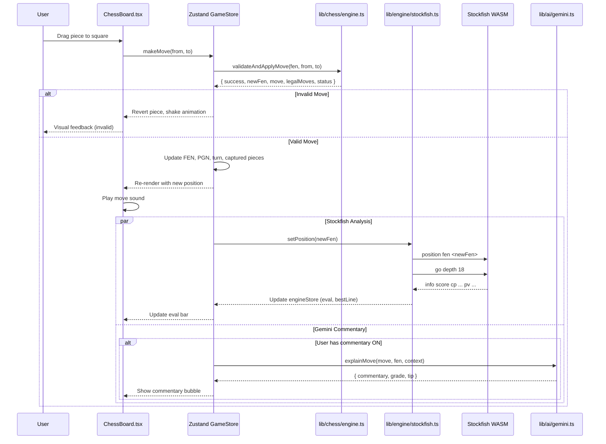
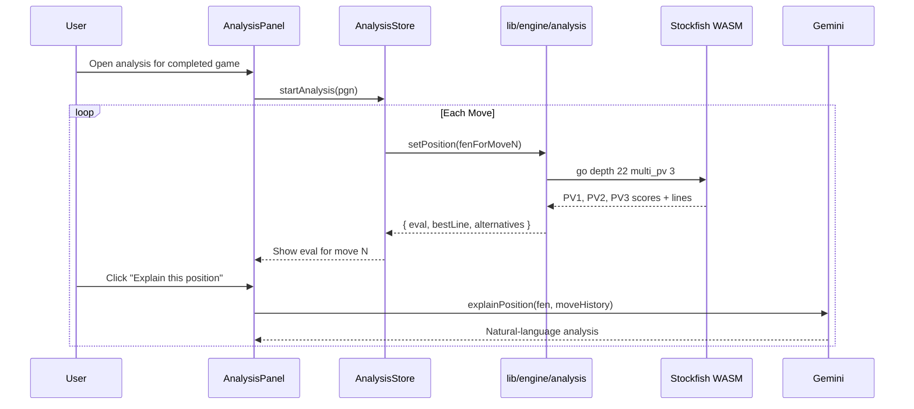
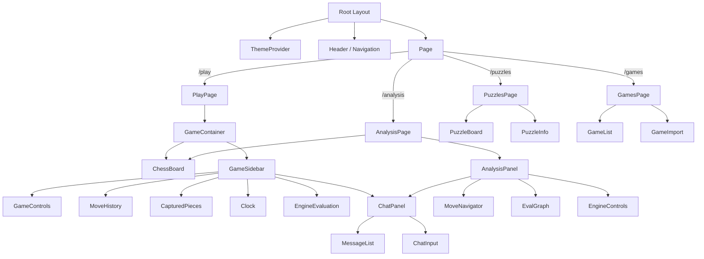

# System Architecture — AI Chess Platform

## High-Level Architecture

```
┌─────────────────────────────────────────────────────────────────────┐
│                         Browser (Client)                           │
│                                                                     │
│  ┌───────────────────┐  ┌────────────────┐  ┌──────────────────┐  │
│  │   Next.js App      │  │  Zustand       │  │  UI Layer        │  │
│  │   (App Router)     │  │  Stores        │  │  (React 19)      │  │
│  │                    │  │                │  │                  │  │
│  │  /play             │  │  gameStore     │  │  ChessBoard.tsx  │  │
│  │  /analysis         │  │  engineStore   │  │  GameControls    │  │
│  │  /puzzles          │  │  settingsStore │  │  ChatPanel       │  │
│  │  /games            │  │  analysisStore │  │  EvalBar         │  │
│  └───────────────────┘  └───────┬────────┘  └──────────────────┘  │
│                                  │                                   │
│  ┌───────────────────────────────┴───────────────────────────────┐  │
│  │                    Business Logic Layer                       │  │
│  │                                                               │  │
│  │  ┌────────────────────┐  ┌──────────────────┐                 │  │
│  │  │  lib/chess/        │  │  lib/ai/         │                 │  │
│  │  │  (chess.js wrapper)│  │  (Gemini client) │                 │  │
│  │  └────────┬───────────┘  └────────┬─────────┘                 │  │
│  │           │                       │                            │  │
│  │  ┌────────┴───────────────────────┴─────────┐                  │  │
│  │  │  lib/engine/ (Stockfish Bridge)          │                  │  │
│  │  │  ┌────────────────────────────────────┐  │                  │  │
│  │  │  │  Web Worker (stockfish.wasm)       │  │                  │  │
│  │  │  │  Separate thread, no DOM access    │  │                  │  │
│  │  │  └────────────────────────────────────┘  │                  │  │
│  │  └──────────────────────────────────────────┘                  │  │
│  └───────────────────────────────────────────────────────────────┘  │
└─────────────────────────────────────────────────────────────────────┘
```

## Module Architecture

```
┌──────────────┐     ┌──────────────────┐     ┌──────────────────┐
│   React      │────►│   Zustand Store  │────►│   lib/chess/     │
│   Components │     │   (game state)   │     │   (chess.js)     │
│              │     │                  │     │                  │
│  User drags  │     │  - FEN           │     │  - makeMove()    │
│  piece →     │     │  - PGN           │     │  - getLegalMoves │
│  square      │     │  - move history  │     │  - isCheckmate() │
│              │     │  - selected sq   │     │  - loadPGN()     │
└──────────────┘     │  - game status   │     └──────────────────┘
                     └──────────────────┘
                             │
                             ▼
                     ┌──────────────────┐     ┌──────────────────┐
                     │  lib/engine/     │────►│  Stockfish       │
                     │  (bridge)        │     │  (Web Worker)    │
                     │                  │     │                  │
                     │  - setPosition() │     │  UCI protocol    │
                     │  - goSearch()    │     │  eval + bestline │
                     │  - stop()        │     │  analysis        │
                     │  - onEval()      │     │  multi-PV        │
                     └──────────────────┘     └──────────────────┘
                     │
                     ▼
                     ┌──────────────────┐     ┌──────────────────┐
                     │  lib/ai/         │────►│  Gemini API      │
                     │  (commentary)    │     │                  │
                     │                  │     │  Natural lang    │
                     │  - analyzeGame() │     │  analysis        │
                     │  - explainMove() │     │  NO move output  │
                     │  - chat()        │     │  NO engine calls │
                     └──────────────────┘     └──────────────────┘
```

## Data Flow — Player Makes a Move



## Data Flow — Game Analysis Session



## Component Tree



## Web Worker Architecture

Stockfish runs in a dedicated Web Worker to avoid blocking the main thread.

```
Main Thread                          Web Worker
────────────                         ──────────
                                     stockfish.wasm loaded
                                     UCI "uciok" received

lib/engine/stockfish.ts               Worker
  │                                     │
  ├── postMessage("position fen ...")──►│  Parse UCI position
  ├── postMessage("go depth 18")──────►│  Start search
  │                                     │
  │                                     ├── info depth 1 ...
  │                                     ├── info depth 2 ...
  │                                     │  (every node evaluated
  │  onmessage ◄───────────────────────┤   on a separate thread)
  │  ├── Parse "info depth 18 score    │
  │  │    cp 45 pv e2e4 e7e5 ..."      │
  │  ├── Update engineStore.eval       │
  │  └── Re-render eval bar            │
  │                                     │
  ├── postMessage("stop")─────────────►│  Halt search
  │                                     └── bestmove e2e4
  │
  User makes move ────────────────────►  New position → repeat
```

## Rendering Strategy

| Route | Rendering | Rationale |
|---|---|---|
| `/` (landing) | Static (SSG) | Content rarely changes, instant load |
| `/play` | Client-side | Chess board is highly interactive |
| `/analysis` | Client-side | Stockfish + Gemini interaction |
| `/puzzles` | Static + Client | Puzzle data is static, interaction is client |
| `/games` | Client-side | Local storage + PGN rendering |

## State Management Architecture

```
Zustand Stores
│
├── gameStore
│   ├── game: Chess (chess.js instance)
│   ├── fen: string
│   ├── pgn: string
│   ├── moveHistory: Move[]
│   ├── selectedSquare: Square | null
│   ├── legalMoves: Square[]
│   ├── capturedPieces: { white: Piece[], black: Piece[] }
│   ├── status: GameStatus ('playing' | 'checkmate' | 'stalemate' | ...)
│   ├── turn: 'w' | 'b'
│   ├── playerColor: 'w' | 'b'
│   ├── makeMove(from, to): void
│   ├── undoMove(): void
│   ├── newGame(): void
│   └── resign(): void
│
├── engineStore
│   ├── eval: number | null
│   ├── bestLine: string[]
│   ├── depth: number
│   ├── multiPv: { score: number, line: string[] }[]
│   ├── isThinking: boolean
│   ├── toggleAnalysis(): void
│   └── setDepth(depth): void
│
├── settingsStore
│   ├── boardTheme: string
│   ├── pieceSet: string
│   ├── soundEnabled: boolean
│   ├── commentaryEnabled: boolean
│   ├── commentaryLevel: 'beginner' | 'intermediate' | 'advanced'
│   ├── aiDifficulty: number (Stockfish depth)
│   └── clockSettings: { initial, increment }
│
└── analysisStore
    ├── currentMoveIndex: number
    ├── engineEvals: EvalAtMove[]
    ├── commentary: Commentary[]
    └── navigateTo(moveIndex): void
```

## Key Design Decisions

| Decision | Rationale |
|---|---|
| **Stockfish in Web Worker** | Prevents UI freezes during engine search. Critical for smooth drag-and-drop. |
| **chess.js wrapper in lib/chess** | Isolates chess.js API so swapping it never touches components. |
| **Gemini in separate lib/ai** | Gemini prompts are constrained not to output moves. Separation makes this auditable. |
| **Zustand over Context** | Context re-renders all consumers. Zustand slices prevent unnecessary renders. No provider needed. |
| **No backend for core play** | Stockfish runs locally. Games are playable offline. Reduces infrastructure cost to ~$0. |
| **Server Components for content routes** | Landing, puzzles list, and static content get instant loads via RSC. |
