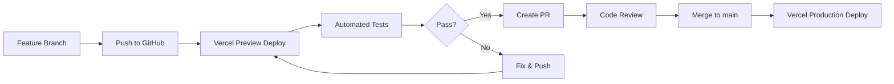

# Deployment — AI Chess Platform

## Hosting Platform

**Vercel** is the deployment platform. It provides:

- Automatic HTTPS and CDN
- Preview deployments per branch/pull request
- Serverless edge functions (future)
- Environment variable management
- Automatic static optimization
- Web Analytics

---

## Production Domain

```
https://ai-chess.com           # Production
https://preview.ai-chess.com   # Preview/staging (future)
```

---

## Vercel Configuration

```json
// vercel.json (create when deploying)
{
  "framework": "nextjs",
  "buildCommand": "npm run build",
  "outputDirectory": ".next",
  "installCommand": "npm install",
  "devCommand": "npm run dev",
  "regions": ["iad1"],
  "headers": [
    {
      "source": "/(.*)",
      "headers": [
        {
          "key": "Content-Security-Policy",
          "value": "default-src 'self'; script-src 'self' 'unsafe-eval'; worker-src 'self' blob:; style-src 'self' 'unsafe-inline'; img-src 'self' data:; connect-src 'self' https://generativelanguage.googleapis.com; font-src 'self'; base-uri 'self'; form-action 'self'"
        },
        {
          "key": "X-Content-Type-Options",
          "value": "nosniff"
        },
        {
          "key": "Referrer-Policy",
          "value": "strict-origin-when-cross-origin"
        }
      ]
    },
    {
      "source": "/stockfish.wasm",
      "headers": [
        {
          "key": "Cache-Control",
          "value": "public, max-age=31536000, immutable"
        }
      ]
    }
  ]
}
```

---

## Environment Variables

```bash
# Production (Vercel Dashboard)
NEXT_PUBLIC_GEMINI_API_KEY=        # Required: Gemini API key
NEXT_PUBLIC_APP_URL=https://ai-chess.com
NEXT_PUBLIC_SENTRY_DSN=            # Future: error tracking
NEXT_PUBLIC_POSTHOG_KEY=           # Future: analytics

# Preview / Development
# Same variables, different values (e.g., test Gemini key with lower quota)
```

---

## Deployment Workflow



### Steps

1. **Developer pushes branch** to GitHub
2. **Vercel automatically deploys** preview at `https://git-branch-name.ai-chess.preview.vercel.app`
3. **GitHub Actions** runs: `lint` → `typecheck` → `test` → `test:coverage` → `build`
4. **Preview URL** is posted to the PR for manual QA
5. **Merge to `main`** triggers production deployment
6. **Production URL** updates automatically (zero-downtime)

---

## Build Optimization

```bash
# next.config.ts
const nextConfig = {
  // Enable SWC minification (default in Next.js 16)
  swcMinify: true,

  // Enable static optimization where possible
  output: 'standalone', // For Docker deployment (future)

  // Image optimization
  images: {
    formats: ['image/avif', 'image/webp'],
  },

  // Enable React strict mode for development
  reactStrictMode: true,

  // Compress responses
  compress: true,
};
```

---

## Stockfish WASM Deployment

Stockfish WASM binary (~2-5 MB) needs special handling:

```typescript
// next.config.ts
const nextConfig = {
  webpack: (config, { isServer }) => {
    // Ensure WASM files are handled correctly
    if (!isServer) {
      config.resolve.fallback = {
        ...config.resolve.fallback,
        fs: false,
        path: false,
      };
    }
    return config;
  },
  // Allow WASM files to be served
  experimental: {
    outputFileTracingIncludes: {
      '/*': ['./node_modules/stockfish.wasm/**/*'],
    },
  },
};
```

---

## Monitoring & Observability (Future)

### Error Tracking — Sentry

```typescript
// sentry.config.ts
import * as Sentry from '@sentry/nextjs';

Sentry.init({
  dsn: process.env.NEXT_PUBLIC_SENTRY_DSN,
  tracesSampleRate: 0.1, // Sample 10% of transactions
  replaysSessionSampleRate: 0.1,
  replaysOnErrorSampleRate: 1.0,
});
```

### Performance Monitoring

```typescript
// Custom performance marks
performance.mark('stockfish-search-start');
// ... engine search ...
performance.mark('stockfish-search-end');
performance.measure('stockfish-search', 'stockfish-search-start', 'stockfish-search-end');

// Report to analytics
const entry = performance.getEntriesByName('stockfish-search').pop();
if (entry) {
  console.info(`Stockfish search took ${entry.duration}ms`);
}
```

### Logging Levels

```typescript
export const logger = {
  debug: (msg: string, data?: unknown) => {
    if (process.env.NODE_ENV === 'development') console.debug(`[DEBUG] ${msg}`, data);
  },
  info: (msg: string, data?: unknown) => {
    console.info(`[INFO] ${msg}`, data);
  },
  warn: (msg: string, data?: unknown) => {
    console.warn(`[WARN] ${msg}`, data);
    // TODO: Send to Sentry as breadcrumb
  },
  error: (msg: string, error?: unknown) => {
    console.error(`[ERROR] ${msg}`, error);
    // TODO: Send to Sentry as error
  },
};
```

---

## Rollback Strategy

```bash
# Vercel CLI rollback
vercel rollback [deployment-url]

# Or via Vercel Dashboard:
# 1. Navigate to Deployments
# 2. Find last known-good deployment
# 3. Click "..." → "Promote to Production"
```

---

## CI/CD Pipeline (Future — GitHub Actions)

```yaml
# .github/workflows/ci.yml
name: CI

on:
  push:
    branches: [main]
  pull_request:
    branches: [main]

jobs:
  quality:
    runs-on: ubuntu-latest
    steps:
      - uses: actions/checkout@v4
      - uses: actions/setup-node@v4
        with:
          node-version: 22
          cache: 'npm'

      - run: npm ci
      - run: npm run lint
      - run: npm run typecheck   # tsc --noEmit
      - run: npm run test:coverage
      - run: npm run build

  e2e:
    needs: quality
    runs-on: ubuntu-latest
    steps:
      - uses: actions/checkout@v4
      - uses: actions/setup-node@v4
      - run: npm ci
      - run: npx playwright install
      - run: npm run build
      - run: npm run test:e2e
```

---

## Pre-Launch Checklist

- [ ] Environment variables configured in Vercel
- [ ] Custom domain configured with SSL
- [ ] CSP headers set
- [ ] robots.txt configured (allow indexing)
- [ ] Sitemap submitted to Google Search Console
- [ ] Open Graph images uploaded for all routes
- [ ] Analytics installed
- [ ] Error tracking installed
- [ ] Rate limiting configured (Gemini API)
- [ ] Lighthouse audit passed (90+)
- [ ] Mobile testing completed (iOS Safari, Android Chrome)
- [ ] Stockfish WASM tested in target browsers
- [ ] PWA manifest configured (future)
- [ ] 404 page customized
- [ ] `vercel.json` configured with headers
- [ ] Production domain tested end-to-end
- [ ] Backup domain redirect configured
