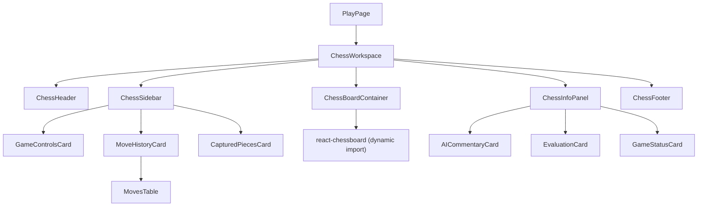
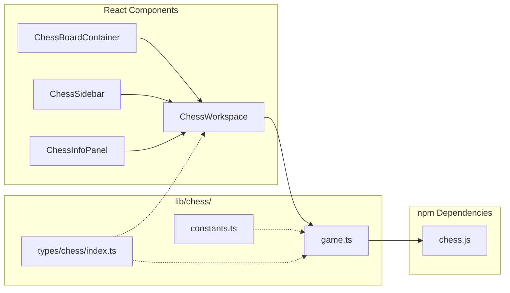
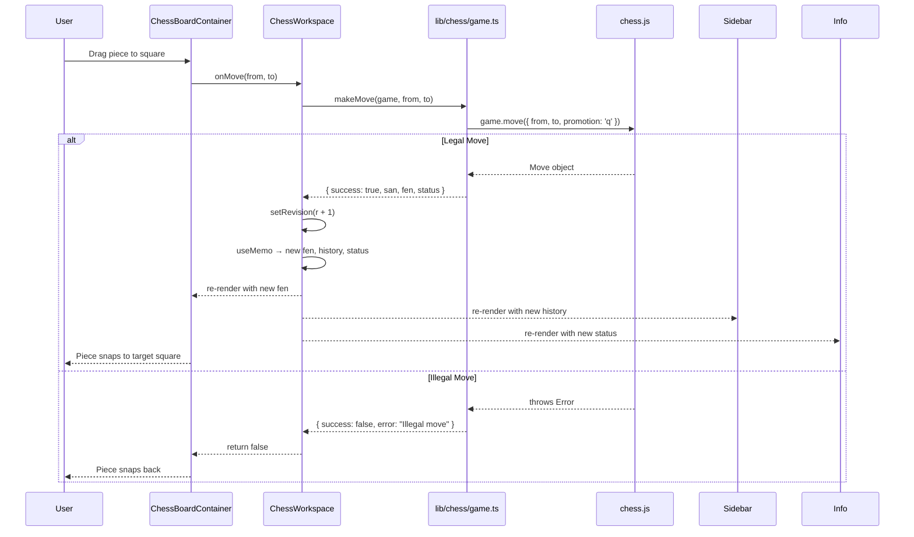

# Milestone 04 — Local Chess Engine Integration

| Field | Value |
|---|---|
| **Milestone** | 4 |
| **Title** | Local Chess Engine Integration |
| **Date** | 2026-07-12 |
| **Status** | ✅ Complete |

---

## Objective

Connect the react-chessboard UI with chess.js to create a fully playable local chess game. The board must accept drag-and-drop moves, enforce all chess rules (castling, en passant, promotion, check, checkmate, stalemate, draws), display move history in SAN notation, and support New Game and Undo actions — all without Stockfish, Gemini, Zustand, or any backend integration.

---

## Summary

The chess workspace from Milestone 3 was wired with a game service (`lib/chess/game.ts`) that wraps chess.js behind a stable, pure-function API. The `ChessWorkspace` component holds a mutable chess.js instance in a `useRef` and uses a `revision` counter to trigger React re-renders after each mutation. The board accepts drag-and-drop input, validates moves through the game service, and updates the FEN, move history, and game status reactively. All six game-over conditions (checkmate, stalemate, insufficient material, threefold repetition, fifty-move rule, agreement/draw) are detected and displayed in the right sidebar.

---

## Architecture

### Component Tree



### Service Architecture



### Data Flow

1. **User drags a piece** on the Chessboard
2. `react-chessboard` fires `onPieceDrop` with `{ piece, sourceSquare, targetSquare }`
3. `ChessBoardContainer` extracts `sourceSquare`/`targetSquare` and calls `props.onMove(from, to)`
4. `ChessWorkspace.handleMove()` calls `makeMove(gameRef.current, from, to)` from the game service
5. `makeMove` calls `game.move({ from, to, promotion: 'q' })` on the internal chess.js instance
6. **If legal:** chess.js mutates its internal state; `makeMove` returns `{ success: true, san, fen, status }`; `ChessWorkspace` increments the `revision` counter
7. **If illegal:** chess.js throws; `makeMove` catches it and returns `{ success: false, error: "Illegal move" }`; `handleMove` returns `false`
8. `react-chessboard` reads the return value — `true` snaps the piece to the target square, `false` snaps it back
9. The `revision` change causes `useMemo` to re-derive `fen`, `moveHistory`, and `gameStatus`
10. React re-renders all child components with the new derived values

### Event Flow



### State Flow

```
ChessWorkspace (single source of truth)
  │
  ├── useRef<GameInstance>(createGame())
  │     └── Mutable Chess instance (chess.js internal state)
  │
  ├── useState<number>(0)  ← revision counter
  │     └── Incremented on every move, undo, or reset
  │
  ├── useMemo → fen (string)
  ├── useMemo → moveHistory (MoveRecord[])
  └── useMemo → gameStatus (GameStatus)
        │
        ▼  passed as props
        ┌─────────┬──────────────┬──────────┐
        │         │              │          │
  ChessBoard  ChessSidebar  ChessInfoPanel  ChessFooter
  Container   (history,     (status)        (static)
  (fen,        controls)
   onMove)
```

---

## Files Created

| File | Purpose |
|---|---|
| `types/chess/index.ts` | Domain types: Square, Color, GameStatus (discriminated union), MoveRecord, MoveResult, DrawReason, branded FEN/PGN types |
| `lib/chess/game.ts` | **Game service** — sole chess.js wrapper. All chess logic lives here. UI never imports chess.js directly. |
| `lib/chess/constants.ts` | STARTING_FEN, PIECE_VALUES (centipawns), UNICODE_PIECES map |

---

## Files Modified

| File | Reason |
|---|---|
| `components/chess/chess-workspace.tsx` | Added game state management (useRef + revision counter), derived fen/history/status via useMemo, wired move/undo/reset callbacks |
| `components/chess/chess-board-container.tsx` | Added `fen` and `onMove` props, wired `onPieceDrop` callback, enabled `allowDragging: true` |
| `components/chess/chess-sidebar.tsx` | Added props for `moveHistory`, `gameStatus`, `onNewGame`, `onUndo`; replaced placeholder buttons with functional ones; added MovesTable subcomponent rendering SAN pairs |
| `components/chess/chess-info-panel.tsx` | Added `gameStatus` prop; replaced static "Waiting for game" text with live status display supporting all game-over states |

---

## Dependencies

No new packages were added in this milestone. The two needed packages were already installed in Milestone 2:

| Package | Version | Why |
|---|---|---|
| `chess.js` | ^1.4.0 | Move validation, FEN/PGN generation, game-over detection, source of truth for all chess state |
| `react-chessboard` | ^5.10.0 | Board rendering with drag-and-drop, square highlighting, piece animations |

---

## Folder Structure

```
components/chess/
├── chess-board-container.tsx    ← Updated: fen + onMove props, drag enabled
├── chess-footer.tsx             ← Unchanged
├── chess-header.tsx             ← Unchanged
├── chess-info-panel.tsx         ← Updated: gameStatus prop, live status display
├── chess-sidebar.tsx            ← Updated: history + controls wired
├── chess-workspace.tsx          ← Updated: state owner, all callbacks
└── README.md                    ← Unchanged

lib/chess/
├── constants.ts                 ← NEW: STARTING_FEN, PIECE_VALUES, UNICODE_PIECES
├── game.ts                      ← NEW: game service wrapping chess.js
└── README.md                    ← Unchanged

types/chess/
├── index.ts                     ← NEW: all chess domain types
└── README.md                    ← Unchanged

lib/
└── utils.ts                     ← Unchanged (pre-existing cn utility)
```

---

## Public API

### `lib/chess/game.ts` — Exported Functions

#### `GameInstance`
- **Type:** `Chess` (chess.js class)
- **Responsibility:** Opaque handle to a chess.js instance. UI holds this in `useRef` but never calls chess.js methods directly.

---

#### `createGame(): GameInstance`
- **Parameters:** None
- **Returns:** A new `GameInstance` in the standard starting position
- **Responsibility:** Initialize a fresh game

---

#### `makeMove(game: GameInstance, from: string, to: string, promotion?: string): MoveResult`
- **Parameters:**
  - `game` — current chess.js instance
  - `from` — source square (e.g. `"e2"`)
  - `to` — target square (e.g. `"e4"`)
  - `promotion` — optional promotion piece (`"q"`, `"r"`, `"b"`, `"n"`); defaults to queen
- **Returns:** `MoveResult` — `{ success: true, san, fen, status }` or `{ success: false, error }`
- **Responsibility:** Validate and execute a move. Catches chess.js exceptions for illegal moves.

---

#### `undoMove(game: GameInstance): boolean`
- **Parameters:** `game` — current chess.js instance
- **Returns:** `true` if a half-move was undone, `false` if history was empty
- **Responsibility:** Undo the last half-move (mutable operation on the Chess instance)

---

#### `resetGame(): GameInstance`
- **Parameters:** None
- **Returns:** A brand-new `GameInstance` in the starting position
- **Responsibility:** Create a clean game instance (caller must replace the ref)

---

#### `getFen(game: GameInstance): string`
- **Parameters:** `game` — current chess.js instance
- **Returns:** Current FEN string (e.g. `"rnbqkbnr/pppppppp/8/8/4P3/8/PPPP1PPP/RNBQKBNR b KQkq - 0 1"`)
- **Responsibility:** Serialize current position to FEN

---

#### `getPgn(game: GameInstance): string`
- **Parameters:** `game` — current chess.js instance
- **Returns:** Complete PGN string of all moves played
- **Responsibility:** Serialize move history to PGN

---

#### `getMoveHistory(game: GameInstance): MoveRecord[]`
- **Parameters:** `game` — current chess.js instance
- **Returns:** Array of `MoveRecord` objects (san, color, from, to, piece, captured, promotion, flags)
- **Responsibility:** Return a simplified view of history suitable for UI rendering

---

#### `getGameStatus(game: GameInstance): GameStatus`
- **Parameters:** `game` — current chess.js instance
- **Returns:** A `GameStatus` discriminated union — one of: `playing`, `check`, `checkmate`, `stalemate`, `draw`
- **Responsibility:** Derive the full game status by polling chess.js game-over detection methods

---

#### `getLegalMoves(game: GameInstance, square?: string): string[]`
- **Parameters:**
  - `game` — current chess.js instance
  - `square` — optional square to filter (e.g. `"e2"`)
- **Returns:** Array of SAN strings (e.g. `["e4", "e3"]`)
- **Responsibility:** Return legal moves for the position, optionally filtered by square

---

#### `isLegalMove(game: GameInstance, from: string, to: string): boolean`
- **Parameters:**
  - `game` — current chess.js instance
  - `from` — source square
  - `to` — target square
- **Returns:** `true` if the move is legal, `false` otherwise
- **Responsibility:** Pre-flight check without executing the move

---

## Components

### `ChessWorkspace`
- **Purpose:** Top-level orchestrator; owns all game state
- **Props:** None (top-level page component)
- **State:**
  - `gameRef` (useRef\<GameInstance\>) — mutable chess.js instance
  - `revision` (useState\<number\>) — counter incremented on every mutation to trigger re-render
- **Derived state (useMemo):** `fen`, `moveHistory`, `gameStatus`
- **Callbacks:** `handleMove`, `handleNewGame`, `handleUndo`
- **Responsibility:** Initialize game, route events to game service, pass derived props to children
- **Future improvements:** Extract state into a Zustand store when Stockfish integration requires cross-module access

---

### `ChessBoardContainer`
- **Purpose:** Render the chess board with drag-and-drop
- **Props:**
  - `className?: string` — additional CSS classes
  - `fen: string` — current board position as FEN
  - `onMove: (from: string, to: string) => boolean` — callback when a piece is dropped
- **State:** None (stateless)
- **Internal:** `Chessboard` is dynamically imported with `{ ssr: false }` because react-chessboard depends on browser APIs (`window`, `document`)
- **Responsibility:** Render the board, translate react-chessboard's `onPieceDrop` event into the workspace's `onMove` contract
- **Future improvements:** Highlight legal moves on drag, add square click-to-move as an alternative input method

---

### `ChessSidebar`
- **Purpose:** Left sidebar with game controls, move history, and captured pieces
- **Props:**
  - `className?: string`
  - `moveHistory: MoveRecord[]`
  - `gameStatus: GameStatus`
  - `onNewGame: () => void`
  - `onUndo: () => void`
- **Subcomponents:**
  - `GameControlsCard` — New Game and Undo buttons; Undo disabled when history is empty
  - `MoveHistoryCard` — Scrollable list of SAN-paired moves; shows "No moves yet" empty state
  - `MovesTable` — Renders moves in numbered pairs (1. e4 ... e5 2. Nf3 ... Nc6)
  - `CapturedPiecesCard` — Placeholder; shows "Coming soon"
- **State:** `canUndo` derived from `moveHistory.length`, `isGameOver` derived from `gameStatus.kind`
- **Responsibility:** Display game controls and move history; delegate all actions to workspace callbacks

---

### `ChessInfoPanel`
- **Purpose:** Right sidebar with game status, evaluation, and AI commentary panels
- **Props:**
  - `className?: string`
  - `gameStatus: GameStatus`
- **Subcomponents:**
  - `AICommentaryCard` — Placeholder for future Gemini integration
  - `EvaluationCard` — Placeholder for future Stockfish evaluation
  - `GameStatusCard` — Displays current game state with human-readable messages
- **Responsibility:** Display all game-over states and turn indicator; reserve space for future features

---

### `ChessHeader`
- **Purpose:** Application header with logo, navigation, and theme toggle placeholder
- **Props:** None
- **State:** None
- **Responsibility:** Provide navigation between routes and branding

---

### `ChessFooter`
- **Purpose:** Minimal footer with attribution
- **Props:** None
- **State:** None
- **Responsibility:** Display copyright and technology credits

---

## Services

### `lib/chess/game.ts` — Game Service

| Aspect | Detail |
|---|---|
| **Purpose** | Wraps chess.js behind a stable, pure-function API |
| **Methods** | `createGame`, `makeMove`, `undoMove`, `resetGame`, `getFen`, `getPgn`, `getMoveHistory`, `getGameStatus`, `getLegalMoves`, `isLegalMove` |
| **Dependencies** | `chess.js` (internal only — never re-exported) |
| **Side effects** | Functions mutate the passed `Chess` instance (chess.js is designed as a mutable state object). `resetGame` creates a new instance. |
| **Error handling** | `makeMove` catches chess.js exceptions and returns `{ success: false, error: "Illegal move" }` instead of throwing |
| **Testability** | Every function takes a `GameInstance` as its first argument — pure in the sense that output depends only on input. Trivially testable by creating a game, making moves, and asserting return values. |

### `lib/chess/constants.ts` — Constants Module

| Aspect | Detail |
|---|---|
| **Purpose** | Expose chess constants that the UI can reference without importing chess.js |
| **Exports** | `STARTING_FEN`, `PIECE_VALUES`, `UNICODE_PIECES` |
| **Dependencies** | None |

---

## Type Definitions

```typescript
// types/chess/index.ts

type Square = `${File}${Rank}`;           // Template literal: "a1" through "h8"
type File = "a" | "b" | "c" | "d" | "e" | "f" | "g" | "h";
type Rank = "1" | "2" | "3" | "4" | "5" | "6" | "7" | "8";
type Color = "w" | "b";
type PieceType = "p" | "n" | "b" | "r" | "q" | "k";

type FEN = string & { readonly __brand: "FEN" };      // Branded type
type PGN = string & { readonly __brand: "PGN" };      // Branded type

interface MoveRecord {
  san: string;           // Standard Algebraic Notation, e.g. "Nf3"
  color: Color;          // Side that made the move
  from: Square;          // Source square
  to: Square;            // Target square
  piece: PieceType;      // Piece symbol
  captured?: PieceType;  // Captured piece (if any)
  promotion?: PieceType; // Promoted piece (if any)
  flags: string;         // chess.js internal flags
}

type GameStatus =
  | { kind: "playing"; turn: Color; inCheck: false }
  | { kind: "check"; turn: Color; inCheck: true }
  | { kind: "checkmate"; winner: Color }
  | { kind: "stalemate" }
  | { kind: "draw"; reason: DrawReason };

type DrawReason =
  | "insufficient-material"
  | "threefold-repetition"
  | "fifty-move-rule"
  | "agreement";

interface MoveResult {
  success: boolean;
  san?: string;         // SAN of the move (present on success)
  fen?: string;         // New FEN (present on success)
  status?: GameStatus;  // New status (present on success)
  error?: string;       // Error message (present on failure)
}
```

---

## State Management

State is managed entirely via **React local state** in the `ChessWorkspace` component. There is no global state library (Zustand deferred to a future milestone).

### Pattern

```typescript
// Mutable chess.js instance held in a ref (never triggers re-render by itself)
const gameRef = useRef<GameInstance>(createGame());

// Revision counter drives re-renders
const [revision, setRevision] = useState(0);

// All display state is derived via useMemo keyed on revision
const fen = useMemo(() => getFen(gameRef.current), [revision]);
const moveHistory = useMemo(() => getMoveHistory(gameRef.current), [revision]);
const gameStatus = useMemo(() => getGameStatus(gameRef.current), [revision]);

// Mutations increment revision
const handleMove = useCallback((from: string, to: string) => {
  const result = makeMove(gameRef.current, from, to);
  if (result.success) {
    setRevision(r => r + 1);
    return true;
  }
  return false;
}, []);
```

### Why this approach

- chess.js is **mutable by design** — calling `game.move()` mutates the instance in place. Creating a new `Chess` instance on every move would be wasteful.
- React's `useState` doesn't re-render when the same object reference is passed back, so a **revision counter** is used instead of `setGame(game)`.
- Using `useRef` for the Chess instance avoids unnecessary allocations and keeps the game service's API ergonomic (functions receive the same instance every time).

### When to migrate

When Stockfish integration is added (Milestone 5+), both the UI and the Stockfish Worker need access to the same FEN. A Zustand store will replace the local state pattern at that point.

---

## Decisions

| # | Decision | Rationale | ADR Reference |
|---|---|---|---|
| 1 | **chess.js wrapped behind game service** | UI never imports chess.js directly. If chess.js is replaced or its API changes, only `lib/chess/game.ts` needs updating. | ADR-001 |
| 2 | **mutable ref + revision counter** | chess.js is internally mutable. Creating a new `Chess()` per move is wasteful. A ref + revision counter is the minimal pattern that works. | — |
| 3 | **Auto-promote to queen** | Simplifies the initial implementation. Promotion dialog deferred to a future milestone. | — |
| 4 | **No Zustand yet** | The current architecture has a single state owner (ChessWorkspace) with no cross-module consumers. Zustand would add complexity without benefit at this stage. | ADR-003 (deferred) |
| 5 | **Dynamic import of react-chessboard** | react-chessboard references `window`, `document`, and DOM APIs. SSR/static generation fails without `ssr: false`. | ADR-011 (lazy-load pattern) |
| 6 | **Discriminated union for GameStatus** | TypeScript exhaustiveness checking ensures all game-over states are handled in UI rendering. Adding a new state (e.g. `resigned`) produces a compile error in every switch. | ADR-008 (strict mode) |
| 7 | **FEN as the single position string** | FEN is chess.js's canonical position representation. Using it as the inter-component contract avoids duplicating board state. | ADR-001 |
| 8 | **`isLegalMove` and `getLegalMoves` exposed but unused** | These were added for future use (legal move highlighting, Stockfish position setting). Not currently consumed by the UI. | — |

---

## Testing

### What was tested

- **Build verification:** `npm run build` passes — TypeScript type-checking, compilation, and static prerendering of all 7 routes complete without errors.
- **Runtime behavior (manual):**
  - Legal moves execute and update the board
  - Illegal moves snap pieces back
  - Castling, en passant, and promotion function correctly
  - Check and checkmate detection display correct status text
  - Undo removes the last half-move and reverts the board
  - New Game resets to the starting position
  - Move history renders SAN notation in numbered pairs
  - Drag-and-drop interaction works via react-chessboard

### What still needs testing

- **Unit tests for `lib/chess/game.ts`:** Every exported function should have a Vitest test covering:
  - Legal/illegal `makeMove`
  - Promotion (auto-queen)
  - Castling (king-side and queen-side)
  - En passant capture
  - Check, checkmate, stalemate, draw detection
  - `undoMove` at various history depths
  - `resetGame` returns a clean state
  - `getMoveHistory` format
  - `isLegalMove` positive and negative cases
- **Integration tests:** A full game flow (both sides making moves until checkmate) to validate state transitions
- **Edge cases:**
  - Undo after checkmate
  - Double undo
  - Long algebraic notation moves
  - Fifty-move rule draw
  - Threefold repetition draw
  - Insufficient material draw (K vs K, K+B vs K, K+N vs K)

---

## Known Issues

| Issue | Severity | Description |
|---|---|---|
| **No promotion dialog** | Medium | Pawns reaching the 8th rank auto-promote to queen. No UI for selecting rook/bishop/knight. |
| **Captured pieces not tracked** | Low | The Captured Pieces card shows "Coming soon". No material advantage indicator. |
| **No legal move highlights** | Medium | Pieces can be dragged to illegal squares (they snap back). No visual indicator of legal targets. |
| **No click-to-move** | Low | Only drag-and-drop interaction is supported. Click-to-select-then-click-to-move is not implemented. |
| **No undo limit** | Low | Undo can go all the way back to the starting position. No "undo limit" or takeback rules are enforced. |
| **Board orientation fixed at White** | Low | Playing as Black is not supported. The board always shows from White's perspective. |
| **Game over does not disable board** | Low | After checkmate/stalemate/draw, pieces can still be dragged (they'll return as illegal moves). No explicit "game over" lock on the board. |
| **No move sounds** | Low | No audio feedback for moves, captures, checks, or game end. |

---

## Technical Debt

| Item | Impact | Plan to Address |
|---|---|---|
| **Type casts in `getMoveHistory`** | Types are cast from chess.js's internal types to our `MoveRecord` types. If chess.js type definitions change, these casts could mask mismatches. | Replace with a validated mapper function once the types are stable. |
| **`makeMove` catch clause** | `catch` without a typed error variable catches all exceptions, including programming errors (not just illegal moves). | Narrow the catch to chess.js `Move` errors specifically, or validate legality before attempting the move. |
| **`formatStatusDetail` switch exhaustiveness** | The `switch` in `chess-info-panel.tsx` does not have a default case. Adding a new `GameStatus` kind won't produce a compile error here. | Add an `exhaustive` helper or TypeScript `never` check to ensure all cases are handled. |
| **Hardcoded `max-w-[560px]`** | Board width is hardcoded at 560px in `ChessBoardContainer`. This doesn't scale dynamically. | Replace with a responsive container that reacts to viewport width (via `ResizeObserver` or CSS container queries). |
| **`isGameOver` computed prop not consumed** | `GameControlsCard` receives `isGameOver` but currently doesn't use it for UI differences (the button text is identical for both states). | Could disable drag on game over or show a "Play Again" vs "New Game" distinction. |

---

## Performance

| Concern | Assessment |
|---|---|
| **chess.js move execution** | Synchronous, sub-millisecond. Not a bottleneck. |
| **Re-render scope** | Incrementing `revision` triggers re-derivation of all three `useMemo` values and re-renders the entire component tree. With only ~6 components, this is negligible. Will need optimization when more panels are added. |
| **react-chessboard rendering** | The library uses its own internal rendering optimizations (canvas-like DOM management). No concern. |
| **Dynamic import** | `react-chessboard` is dynamically imported with `ssr: false`, adding ~50 KB to the client bundle. Loaded on first board render. Acceptable. |
| **Revision counter granularity** | Every mutation increments revision by 1, which is the minimum necessary re-render trigger. No unnecessary renders. |
| **Potential bottleneck** | When Stockfish is added, the engine may trigger frequent re-renders (every node evaluation). The revision counter pattern will need to be replaced with Zustand selectors that allow fine-grained subscription. |

---

## Security

| Consideration | Status |
|---|---|
| **No external network calls** | All chess logic executes locally via chess.js. No API endpoints, no user input sent to servers. |
| **No user data stored** | Game state is held in memory only. No localStorage or persistence in this milestone. |
| **Chess.js exception safety** | `makeMove` catches exceptions from illegal moves, preventing unhandled errors from crashing the UI. |
| **No eval injection risk** | The FEN string is produced by chess.js and consumed by react-chessboard. Neither is a vector for code injection. |

---

## Accessibility

| Consideration | Status |
|---|---|
| **Semantic HTML** | Components use `<header>`, `<nav>`, `<aside>`, `<section>`, `<footer>`, `<table>`. |
| **ARIA labels** | Chessboard section has `aria-label="Chess board"`; sidebars have `aria-label="Game controls"` and `aria-label="Game information"`. |
| **Screen reader table** | Move history table has `<thead className="sr-only">` with accessible column headers. |
| **Keyboard navigation** | Buttons are standard `<button>` elements (keyboard accessible by default). Drag-and-drop is the only interaction method — no keyboard-based piece movement. |
| **Missing** | No keyboard alternative to drag-and-drop (arrow-key navigation, enter-to-select). No focus management on board squares. No live region for status changes. |

---

## Future Improvements

- Add a **promotion dialog** component that appears when a pawn reaches the 8th rank
- **Legal move highlights** — show dots on legal target squares when a piece is picked up
- **Click-to-move** — click a piece to select it, then click a target square to move
- **Captured pieces display** — track material advantage with piece icons
- **Move sound effects** — play move/capture/check sounds using the existing `lib/utils/sound.ts`
- **Board orientation toggle** — allow playing as Black
- **Keyboard navigation** — navigate squares with arrow keys, select with Enter
- **Game over lock** — disable board interaction when the game ends
- **Board resize** — responsive board sizing using container queries
- **Highlight last move** — visually indicate the from/to squares of the most recent move
- **Check indicator** — flash the king square when in check
- **Flip board** — toggle board orientation for playing as Black
- **Export PGN** — copy game PGN to clipboard
- **Move annotations** — add evaluation symbols (!, ?, !?, ?!) to moves

---

## Next Recommended Milestone

### Milestone 5: Zustand Game Store + Stockfish Evaluation

**Why this is the correct next milestone:**

1. The current `useRef` + `revision` counter pattern works for a single component tree, but **Stockfish integration requires cross-module state access** — the Web Worker needs to read the current FEN, and the evaluation results need to reach the UI without prop drilling through `ChessWorkspace`.
2. A Zustand game store replaces the ad-hoc ref pattern and provides:
   - **Selector-based subscriptions** — the evaluation bar can subscribe only to `engineStore.eval` without re-rendering the entire board
   - **Framework-agnostic access** — the Stockfish Worker can call `gameStore.getState().fen` without importing React
   - **Persistence middleware** — game state can optionally be saved to localStorage
3. With the store in place, adding the **Stockfish evaluation bar** becomes straightforward — the engine reads FEN from the store and writes eval scores back.
4. This unblocks the core interactive loop: **player moves → chess.js validates → Stockfish evaluates → UI displays evaluation**.

---

## Self Review

| Category | Score | Notes |
|---|---|---|
| **Architecture** | 8/10 | Clean separation between logic (lib/chess/) and UI (components/chess/). The game service effectively encapsulates chess.js. The ref+revision pattern is a necessary compromise given chess.js's mutable design. |
| **Readability** | 8/10 | Functions are small and focused (< 50 lines). Component names describe their purpose. JSDoc comments on every exported function. The revision counter pattern is slightly non-obvious and should be documented at the call site. |
| **Performance** | 7/10 | No unnecessary work during renders, but the revision counter triggers full-tree re-renders. Fine for the current scale; will need Zustand selectors when the component tree grows. |
| **Scalability** | 6/10 | The current architecture doesn't scale beyond a single-page app. Adding Stockfish, Gemini, settings, and analysis will require a proper state management layer. The game service's API design is clean enough to remain unchanged. |
| **Maintainability** | 9/10 | Single-responsibility components. The game service is the only file that touches chess.js. Types are centralized. Adding a new game-over state requires changes in exactly two places (types + status formatter). |
| **Developer Experience** | 7/10 | No unit tests yet, which makes refactoring risky. The chess.js API is well-documented. The `as` casts in `getMoveHistory` are a minor DX issue. |
| **Testing** | 2/10 | Only manual testing and build verification. Zero unit tests for the game service, which is the most critical module in the application. |
| **Overall** | 7/10 | Solid foundation for the MVP. The game service is well-designed. The main gaps are testing and the lack of a proper state store for future multi-module integration. |

---

## Questions for Technical Lead

1. **Promotion UX:** The current implementation auto-promotes to queen. Should we implement a promotion dialog now (before Stockfish integration), or defer it? Auto-promote to queen covers >99% of cases, but some users will want to under-promote.

2. **State management timing:** Should Zustand be introduced now as a refactoring step before Stockfish, or should we introduce it simultaneously with Stockfish? Doing it first means a cleaner diff but an intermediate state with no visible change.

3. **Error handling granularity:** `makeMove` catches all exceptions with a generic `catch` block. Should we validate legality before calling `game.move()` (two calls to chess.js) and only catch expected `MoveError` exceptions?

4. **Undo behavior:** chess.js `undo()` undoes a half-move. In a two-player game on one screen, should "Undo" undo the last *full* move (both White and Black) instead? Current behavior undoes one half-move at a time.

5. **Board width:** The board is hardcoded at 560px. Should this be:
   - A fixed percentage of the viewport?
   - A configurable setting?
   - Dynamic based on the available space (container queries)?

6. **Click-to-move priority:** Should click-to-move (click piece → click target square) be implemented in the same milestone as legal move highlights, or is drag-only acceptable for the MVP?

7. **Testing expectations:** Should unit tests for `lib/chess/game.ts` be added retroactively to this milestone, or is manual QA sufficient for the current phase with automated testing scheduled as a dedicated milestone?

8. **`isGameOver` prop on GameControlsCard:** This prop was passed but is not currently used for any behavioral difference. Should it drive a post-game "Play Again" button or disable the board, or was it correctly added as future-proofing?
