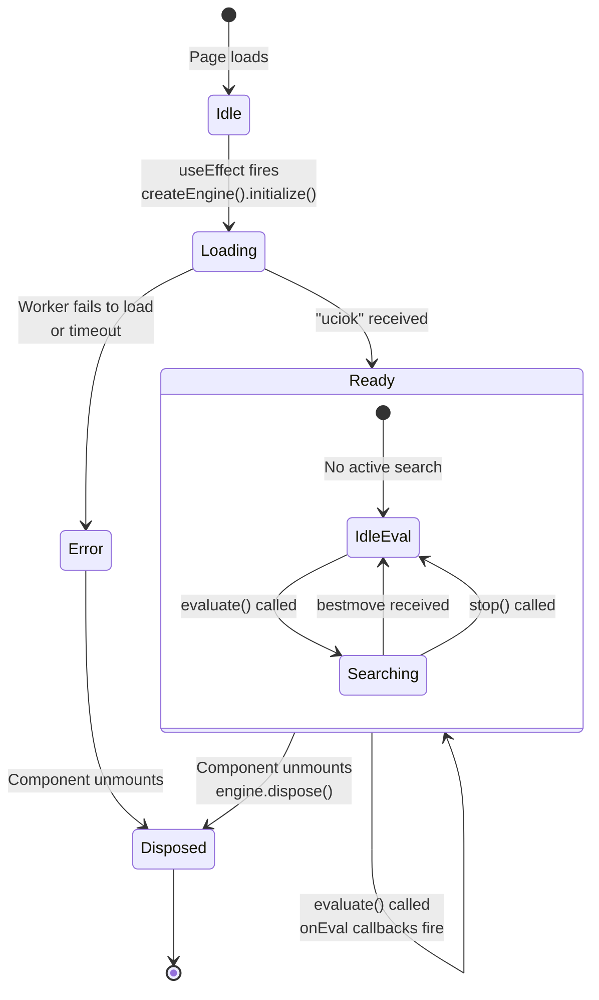
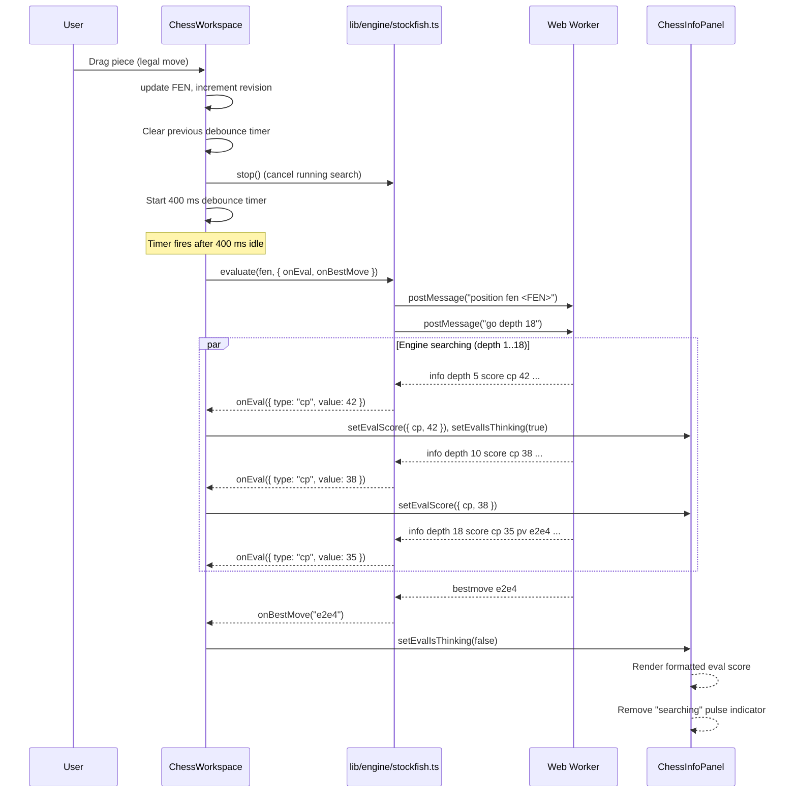

# Milestone 05 — Stockfish Engine Integration

| Field | Value |
|---|---|
| **Milestone** | 5 |
| **Title** | Stockfish Engine Integration |
| **Date** | 2026-07-12 |
| **Status** | ✅ Complete |

---

## Objective

Integrate the Stockfish chess engine into the chess platform via a Web Worker, providing real-time position evaluation and best-move calculation. The engine must run off the main thread, communicate via UCI protocol, and feed evaluation scores into the UI through a state-machine-driven EvaluationCard. The integration must be lazy-initialized, support debounced re-evaluation on position changes, and handle the full lifecycle (init, search, stop, dispose) without leaking resources.

---

## Summary

Stockfish WASM was loaded into a classic Web Worker (`public/stockfish/worker.js`) via `importScripts`. A bridge module (`lib/engine/stockfish.ts`) exposes a `createEngine()` factory that wraps Worker lifecycle and UCI message parsing behind a clean promise-based API. The `ChessWorkspace` component initializes the engine on mount, debounces evaluation requests 400 ms after each FEN change, and drives a four-state engine status machine (`idle` / `loading` / `ready` / `error`) displayed in the `EvaluationCard`. The next.config.ts was updated to serve Stockfish WASM with immutable cache headers. The `stockfish.wasm` npm package was added as a dependency and its artifacts (`stockfish.js`, `stockfish.wasm`) were copied to `public/stockfish/`.

---

## Architecture

### Engine Layer in System Architecture

```mermaid
graph TB
    subgraph UI [React Components]
        Workspace[ChessWorkspace]
        InfoPanel[ChessInfoPanel]
        EvalCard[EvaluationCard]
    end

    subgraph Store [Zustand Stores / Local State]
        GameState[FEN / Game Status]
        EngineState[engineStatus, evalScore, evalIsThinking]
    end

    subgraph Bridge [lib/engine/]
        StockfishTS[stockfish.ts<br/>createEngine()]
    end

    subgraph Worker [Web Worker Thread]
        WorkerJS[worker.js<br/>entry point]
        StockfishJS[stockfish.js<br/>UCI glue code]
        Wasm[stockfish.wasm<br/>340 KB binary]
    end

    subgraph Types [types/]
        EngineTypes[engine.ts<br/>EvalScore, EngineCallbacks,<br/>SearchOptions, EngineState]
    end

    Workspace --> |initialize / evaluate / stop| StockfishTS
    Workspace --> |reads| GameState
    Workspace --> |writes| EngineState
    InfoPanel --> |reads| EngineState
    EvalCard --> |renders| EngineState
    StockfishTS --> |formatEval| EngineTypes
    StockfishTS --> |postMessage| WorkerJS
    WorkerJS --> |importScripts| StockfishJS
    StockfishJS --> |instantiates| Wasm
    StockfishJS --> |self.postMessage| StockfishTS
```

### Engine State Flow



### Evaluation Lifecycle



---

## Files Created

| File | Purpose |
|---|---|
| `types/engine.ts` | Engine type definitions: `EvalScore` (cp/mate union), `formatEval()` display helper, `EngineState` (isReady, isThinking, evaluation, bestMove), `SearchOptions` (depth, movetime), `EngineCallbacks` (onEval, onBestMove, onReady, onError) |
| `lib/engine/stockfish.ts` | **Engine bridge** — `createEngine()` factory wrapping Web Worker lifecycle. Exposes `initialize()`, `evaluate()`, `getBestMove()`, `stop()`, `dispose()`, `ready()`. Parses UCI output lines for `score cp`, `score mate`, `bestmove`, `uciok`, `readyok`. |
| `public/stockfish/worker.js` | **Web Worker entry point** — single-line script that imports Stockfish WASM glue via `importScripts("/stockfish/stockfish.js")`. The glue code registers its own `onmessage` handler in the Worker scope. |
| `public/stockfish/stockfish.js` | Stockfish WASM JavaScript glue code (~30 KB) — auto-generated by the stockfish.wasm npm package. Compiled IIFE/UMD that loads stockfish.wasm and registers a UCI-compatible message handler. |
| `public/stockfish/stockfish.wasm` | Stockfish WebAssembly binary (~340 KB) — compiled C++ engine. Loaded lazily by stockfish.js when the Worker processes its first UCI command. |

---

## Files Modified

| File | Reason |
|---|---|
| `components/chess/chess-workspace.tsx` | Added engine initialization on mount (useEffect → createEngine → initialize()), engine state variables (engineStatus, evalScore, evalIsThinking, engineErrorMessage), debounced evaluation on FEN change (400 ms debounce with cleanup), pass engine props to ChessInfoPanel |
| `components/chess/chess-info-panel.tsx` | Added `EvaluationCard` component rendering a four-state machine: loading ("Loading Stockfish engine…"), error (red error message), ready with no score ("Waiting for position…"), ready with score (formatted eval + "searching" pulse), idle ("Engine not available") |
| `next.config.ts` | Added `Cache-Control: public, max-age=31536000, immutable` header for all assets under `/stockfish/` to ensure the WASM binary and glue code are aggressively cached |
| `package.json` | Added `"stockfish.wasm": "^0.10.0"` dependency |

### Dependencies

| Package | Version | Purpose |
|---|---|---|
| `stockfish.wasm` | ^0.10.0 | Pre-compiled Stockfish 16 engine compiled to WebAssembly. Provides `stockfish.js` (UCI glue code) and `stockfish.wasm` (binary). |

---

## API Documentation

### `createEngine(): Engine`

- **Module:** `lib/engine/stockfish.ts`
- **Returns:** An `Engine` object with the methods below
- **Responsibility:** Factory function that encapsulates a single Web Worker instance. The Worker is created lazily on the first command. All communication with the Worker flows through a single permanent `message` event handler, which dispatches to the currently active `currentCallbacks` object.
- **Internal state:**
  - `worker: Worker | null` — lazy-initialized Worker reference
  - `isReady: boolean` — set after `initialize()` resolves
  - `currentCallbacks: EngineCallbacks | null` — replaced on each `evaluate()` call; stale callbacks from previous searches are discarded

---

#### `initialize(): Promise<void>`

- **Sends:** `postMessage("uci")`
- **Waits for:** `"uciok"` response from the Worker
- **Resolves:** When `uciok` is received and `isReady` is set to `true`
- **Rejects:** On Worker `error` event (e.g., WASM binary failed to load)
- **Must be called:** Before any other commands. Only called once per engine lifecycle.

---

#### `evaluate(fen: string, callbacks: EngineCallbacks, options?: SearchOptions): void`

- **Parameters:**
  - `fen` — position in FEN notation
  - `callbacks` — `EngineCallbacks` object with optional handlers:
    - `onEval?: (score: EvalScore) => void` — fired on each `info score cp` or `info score mate` line
    - `onBestMove?: (move: string) => void` — fired on `bestmove <move>` line
    - `onReady?: () => void` — fired on `readyok`
    - `onError?: (error: string) => void` — fired on engine errors
  - `options` — `SearchOptions`:
    - `depth?: number` — search depth (1–99, default 18)
    - `movetime?: number` — search time in milliseconds (overrides depth)
- **Behavior:**
  1. Calls `stop()` to cancel any running search
  2. Replaces `currentCallbacks` with the new callbacks object
  3. Sends `position fen <fen>` to set the position
  4. Sends `go depth <depth>` or `go movetime <movetime>` to start search
- **Side effects:** Previous search results are discarded. Previous `currentCallbacks` are no longer invoked.

---

#### `getBestMove(fen: string, callbacks: EngineCallbacks, options?: SearchOptions): void`

- **Behavior:** Identical to `evaluate()`. Exists as a semantic alias for consumers that only care about the best move, not intermediate evaluation scores.

---

#### `stop(): void`

- **Sends:** `postMessage("stop")` (only if Worker exists)
- **Clears:** `currentCallbacks` to null
- **Effect:** Halts any running search. Subsequent `info` or `bestmove` lines from the Worker are ignored because `currentCallbacks` is null.

---

#### `dispose(): void`

- **Calls:** `stop()` first
- **Calls:** `worker.terminate()` to kill the Worker thread
- **Resets:** `worker = null`, `isReady = false`, `currentCallbacks = null`
- **Effect:** Frees all resources. Engine is no longer usable. Called automatically in the cleanup function of the `useEffect` that initializes the engine.

---

#### `ready(): boolean`

- **Returns:** `isReady` flag (true after `initialize()` resolves)
- **Purpose:** Lightweight synchronous check for consumers that need to know if the engine is available.

---

### Types

```typescript
// types/engine.ts

interface EvalScore {
  type: "cp" | "mate";
  value: number;           // centipawns (cp) or moves-to-mate (mate)
}

// +0.45, -1.23, Mate in 3, Mate in 1
function formatEval(score: EvalScore): string;

interface EngineState {
  isReady: boolean;
  isThinking: boolean;
  evaluation: EvalScore | null;
  bestMove: string | null;
}

interface SearchOptions {
  depth?: number;          // 1–99, default 18
  movetime?: number;       // milliseconds, overrides depth
}

interface EngineCallbacks {
  onEval?: (score: EvalScore) => void;
  onBestMove?: (move: string) => void;
  onReady?: () => void;
  onError?: (error: string) => void;
}

type EngineStatus = "idle" | "loading" | "ready" | "error";

// Return type of createEngine()
interface Engine {
  initialize: () => Promise<void>;
  evaluate: (fen: string, callbacks: EngineCallbacks, options?: SearchOptions) => void;
  getBestMove: (fen: string, callbacks: EngineCallbacks, options?: SearchOptions) => void;
  stop: () => void;
  dispose: () => void;
  ready: () => boolean;
}
```

---

## Component Documentation

### `ChessWorkspace` — Engine Integration

| Aspect | Detail |
|---|---|
| **New state** | `engineRef` (useRef\<Engine\>), `engineStatus` (useState\<"idle"\|"loading"\|"ready"\|"error"\>), `evalScore` (useState\<EvalScore\|null\>), `evalIsThinking` (useState\<boolean\>), `engineErrorMessage` (useState\<string\|null\>), `debounceRef` (useRef\<setTimeout\>) |
| **Lifecycle** | `useEffect` on mount: creates engine, calls `initialize()`, sets status to `loading`, resolves to `ready` or rejects to `error`. Cleanup function calls `engine.dispose()`. |
| **Evaluation trigger** | Second `useEffect` keyed on `[fen, engineStatus]`: clears any pending debounce timer, calls `engine.stop()`, sets a 400 ms debounce, then calls `engine.evaluate(fen, ...)` with `onEval` and `onBestMove` callbacks that update `evalScore` and `evalIsThinking`. Cleanup clears the timer and stops the engine. |
| **Props passed down** | `evalScore`, `evalIsThinking`, `engineStatus`, `engineErrorMessage` passed to `ChessInfoPanel` |

### `ChessInfoPanel` — EvaluationCard

| Aspect | Detail |
|---|---|
| **Props** | `gameStatus`, `evalScore`, `evalIsThinking`, `engineStatus`, `engineErrorMessage` |
| **Subcomponents** | `AICommentaryCard` (unchanged placeholder), `EvaluationCard` (new), `GameStatusCard` (unchanged) |
| **EvaluationCard** | Renders based on a four-state machine (see Evaluation Display section below). Uses `formatEval()` from `types/engine.ts` to display centipawn scores as human-readable strings (e.g., "+0.42", "Mate in 3"). Includes a pulsing "searching" indicator when engine is thinking. |

---

## UCI Protocol Reference

All communication with Stockfish follows the Universal Chess Interface (UCI) protocol via `postMessage` / `message` events on the Web Worker.

### Commands Sent

| Command | When | Example |
|---|---|---|
| `uci` | `initialize()` | `worker.postMessage("uci")` |
| `isready` | (reserved for future use) | `worker.postMessage("isready")` |
| `position fen <FEN>` | `evaluate()`, `getBestMove()` | `worker.postMessage("position fen rnbqkbnr/pppppppp/8/8/4P3/8/PPPP1PPP/RNBQKBNR b KQkq - 0 1")` |
| `position startpos moves <moves>` | Future: game move sequence | `worker.postMessage("position startpos moves e2e4 e7e5")` |
| `go depth <N>` | `evaluate()` with default or depth option | `worker.postMessage("go depth 18")` |
| `go movetime <N>` | `evaluate()` with movetime option | `worker.postMessage("go movetime 5000")` |
| `stop` | `stop()`, `dispose()`, before each new evaluate() | `worker.postMessage("stop")` |

### Output Lines Parsed

| Pattern | Handler | Example | Data Extracted |
|---|---|---|---|
| `score cp (-?\d+)` | `onEval` | `info depth 18 score cp 45 ...` | `{ type: "cp", value: 45 }` |
| `score mate (-?\d+)` | `onEval` | `info depth 22 score mate 3 ...` | `{ type: "mate", value: 3 }` |
| `^bestmove (\S+)` | `onBestMove` | `bestmove e2e4 ponder d7d5` | `"e2e4"` |
| `uciok` | `initialize()` resolve | `uciok` | (no data — signals readiness) |
| `readyok` | `onReady` | `readyok` | (no data — signals readiness) |

### Lines Explicitly Ignored

- `info` lines without `score cp` or `score mate` (e.g., `info nodes 12345 nps 500000`)
- `info` lines with `pv` only (the PV is not used in this milestone, only the score)
- `bestmove` lines after `currentCallbacks` has been nulled by `stop()`
- `ponder` portion of `bestmove` output (only the first move token is extracted)

---

## Web Worker Architecture

### Worker Entry Point

```
public/stockfish/worker.js
──────────────────────────
importScripts("/stockfish/stockfish.js");
```

- **Classic Worker** (not a module Worker) — uses `importScripts()` for synchronous loading
- **Compatibility:** Works in all modern browsers. No module preload needed.
- **`importScripts` behavior:** Blocks execution until stockfish.js finishes loading, which includes instantiating the WASM binary. By the time `worker.js` finishes, the engine is ready to receive UCI commands.
- **No explicit `onmessage` handler** in worker.js — the stockfish.js glue code registers its own `self.onmessage` handler that processes UCI commands and calls `self.postMessage()` for output.

### Communication Architecture

```
Main Thread (lib/engine/stockfish.ts)          Web Worker
────────────────────────                      ──────────
new Worker("/stockfish/worker.js")
  ── Worker created, starts loading ──────►   importScripts("stockfish.js")
                                               stockfish.js instantiation
                                               WASM binary load
                                               Engline registers onmessage handler
                                               Engine is now idle, waiting for commands

postMessage("uci")                           ──►   onmessage: process UCI command
                                                       Engine sends "uciok"
◄── message event: "uciok"                         postMessage("uciok")
  resolve initialize() promise

postMessage("position fen ...")               ──►   onmessage: set position
postMessage("go depth 18")                    ──►   onmessage: start search
                                                       Engine computes...
◄── message event: "info ... score cp 45"          postMessage("info ...")
  parse → onEval({ cp, 45 })
◄── message event: "bestmove e2e4"                postMessage("bestmove e2e4")
  parse → onBestMove("e2e4")
```

### The `currentCallbacks` Pattern

The bridge uses a **single permanent message handler** attached once during Worker construction. This handler (`handleMessage`) reads `currentCallbacks` from the closure:

```typescript
let currentCallbacks: EngineCallbacks | null = null;

function handleMessage(event: MessageEvent): void {
  const line = String(event.data);
  if (!currentCallbacks) return;  // discard stale output

  // parse and dispatch to currentCallbacks.onEval / onBestMove
}

worker.addEventListener("message", handleMessage);
```

When `evaluate()` is called:
1. `stop()` nulls `currentCallbacks` (future messages are discarded)
2. `currentCallbacks` is set to the new callbacks object
3. The Worker processes the new position and search command
4. All subsequent messages are dispatched to the current callbacks

This avoids the need to add/remove event listeners per search, and naturally prevents stale search results from reaching the UI when the position changes mid-search.

### Worker Disposal

A Worker instance consumes a full OS thread. `dispose()` calls `worker.terminate()` which immediately kills the thread without cleanup. This is acceptable because:
- The Worker has no persistent state to save
- WASM memory is freed by the browser when the Worker is terminated
- A new Worker can be created on the next `initialize()` call (though in practice the engine lives for the page's lifetime)

---

## Evaluation Display

The `EvaluationCard` component implements a four-state state machine driven by the `engineStatus` prop plus the presence or absence of `evalScore` and `evalIsThinking`.

### State Machine

```
                    ┌─────────────────────────────┐
                    │         idle                 │
                    │   "Engine not available"     │
                    └─────────────┬───────────────┘
                                  │ createEngine() called
                                  ▼
                    ┌─────────────────────────────┐
                    │        loading               │
                    │   "Loading Stockfish         │
                    │    engine…"                  │
                    └─────────────┬───────────────┘
                          ┌──────┴──────┐
                          ▼             ▼
              ┌─────────────────┐  ┌─────────────────┐
              │     ready       │  │     error       │
              │                 │  │  Red text:      │
              │  ┌─ no score ─┐ │  │  error message  │
              │  │ "Waiting   │ │  └─────────────────┘
              │  │  for       │ │
              │  │  position…"│ │
              │  └────────────┘ │
              │  ┌─ thinking ─┐ │
              │  │ "Loading…"│ │  (no score yet)
              │  └───────────┘ │
              │  ┌─ score ────┐ │
              │  │  +0.42     │ │
              │  │  [search-  │ │
              │  │  ing pulse]│ │
              │  └────────────┘ │
              │  ┌─ score,    ┐ │
              │  │  not think-│ │
              │  │  ing       │ │
              │  │  +0.42     │ │
              │  └────────────┘ │
              └─────────────────┘
```

### UI Rendering Per State

| `engineStatus` | `score` | `isThinking` | Rendered Output |
|---|---|---|---|
| `"idle"` | any | any | "Engine not available" (muted text) |
| `"loading"` | any | any | "Loading Stockfish engine…" (muted text) |
| `"error"` | any | any | error message or "Engine failed to load" in red (`text-destructive`) |
| `"ready"` | `null` | `false` | "Waiting for position…" (muted text) |
| `"ready"` | `null` | `true` | "Loading…" (muted text) |
| `"ready"` | `EvalScore` | `true` | Formatted eval (bold, large font) + "searching" pulse indicator |
| `"ready"` | `EvalScore` | `false` | Formatted eval only (bold, large font) |

### Formatting Rules (`formatEval`)

| Score | Output |
|---|---|
| `{ type: "cp", value: 45 }` | `"+0.45"` |
| `{ type: "cp", value: 0 }` | `"+0.00"` |
| `{ type: "cp", value: -123 }` | `"-1.23"` |
| `{ type: "mate", value: 3 }` | `"Mate in 3"` |
| `{ type: "mate", value: -2 }` | `"Mate in 2"` |
| `{ type: "mate", value: 1 }` | `"Mate in 1"` |

---

## Architecture Decisions

### ADR-016: createEngine() Factory with Single Message Handler

- **Status:** Accepted
- **Category:** PERF
- **Date:** 2026-07-12
- **Supersedes:** None

#### Context

The Stockfish bridge must manage a Web Worker's lifecycle, parse UCI protocol output, and deliver evaluation callbacks to the UI. Multiple design options exist for structuring this bridge: a class, a singleton, a factory function, or a global event bus.

#### Decision

Use a **`createEngine()` factory function** that returns a plain object with methods. The factory encapsulates:

1. **A single permanent message handler** on the Worker, with a replaceable `currentCallbacks` pointer. On each `evaluate()` call, stale callbacks are replaced, so out-of-order responses from a previous search are silently discarded.
2. **Lazy Worker creation** — the Worker is only instantiated on the first command (or `initialize()`), not at construction time.
3. **Closure-based privacy** — all internal state (`worker`, `isReady`, `currentCallbacks`) is captured in the closure, not exposed on the returned object.
4. **No class inheritance** — the returned object is a simple function object, not an instance, making it trivially mockable in tests.

#### Alternatives Considered

| Option | Reason Against |
|---|---|
| **Class (`class Engine { }`)** | Requires `new` and `this` binding. Methods on the class would need to be bound or arrow-function properties to maintain context in callbacks. Factory avoids class overhead entirely. |
| **Singleton module** | Would prevent multiple engine instances (needed for future multi-variation analysis or engine comparison). Also makes testing harder (module-level state persists across tests). |
| **Event emitter** | Adds unnecessary event infrastructure. The engine has only 4 event types (eval, bestMove, ready, error). Callbacks are simpler and type-safe. |
| **Redux/Zustand middleware** | Couples engine state to a global store. The engine works without a store (current architecture uses local state in ChessWorkspace). |

#### Consequences

- No `new` keyword needed — engine is created with `const engine = createEngine()`
- State is truly private — no risk of external code corrupting `worker` or `currentCallbacks`
- Testing: callbacks are passed directly to `evaluate()` — easy to assert they were called
- The factory can be extended with configuration options (e.g., `createEngine({ wasmURL: "/custom/path" })`) in the future
- Single message handler means no listener management — no risk of memory leaks from unregistered listeners

#### References

- `lib/engine/stockfish.ts` — Implementation
- `components/chess/chess-workspace.tsx` — Consumer
- `ARCHITECTURE.md` — Web Worker Architecture section
- `CLAUDE.md` — Chess Engine Rules (Stockfish is the only engine)

---

### ADR-015: React 19 Server Components for Content, Client Components for Interaction

- **Status:** Accepted (pre-existing — see `docs/DECISIONS.md`)
- **Note:** This ADR already exists in DECISIONS.md and is not new to Milestone 5. It is listed here for completeness of the milestone report.

---

## Security Considerations

| Consideration | Status |
|---|---|
| **Worker runs without DOM access** | Web Workers have no access to `window`, `document`, or DOM APIs. Even if the stockfish.wasm binary were compromised, the attack surface is limited to engine computation, not UI manipulation. |
| **No network calls from Worker** | Stockfish runs fully locally. The Worker never makes HTTP requests, reads cookies, or accesses localStorage. The only I/O is `postMessage` with the main thread. |
| **UCI input sanitization** | The only input to the Worker is UCI commands constructed by the bridge (`position fen <FEN>`, `go depth <N>`, etc.). The FEN string is produced by chess.js, which is a trusted source. No user-supplied strings reach the Worker. |
| **Worker disposal** | `dispose()` calls `worker.terminate()` which kills the thread. No possibility of orphaned Workers continuing to run after the component unmounts. |
| **WASM binary integrity** | The stockfish.wasm binary is served from the same origin with immutable caching. No CDN or third-party script load — the binary is from the `stockfish.wasm` npm package, verified at install time. |
| **No eval injection** | Evaluation scores flow from the Worker through `onEval` callbacks to React state. React's default escaping prevents XSS even if the score string contained malicious content. |

---

## Performance Considerations

| Concern | Assessment |
|---|---|
| **Worker thread offload** | Stockfish runs on a separate OS thread. The main thread (React rendering, drag-and-drop, event handling) is never blocked during engine search. |
| **Debounced evaluation** | 400 ms debounce prevents re-evaluation on every intermediate FEN update during rapid play. Only the final position after a burst of moves is evaluated. |
| **`stop()` before new search** | Cancels the previous search immediately before starting a new one. Prevents two Workers from competing for CPU. |
| **Default depth 18** | Depth 18 provides a good balance between accuracy (~2500 Elo strength) and response time (1–3 seconds on modern hardware). Configurable via `SearchOptions.depth`. |
| **Worker lifecycle** | Worker is created once and reused for the page lifetime. No repeated Worker instantiation overhead. |
| **WASM binary size** | stockfish.wasm is ~340 KB. Loaded once on first engine initialization (lazy — not on page load). Served with immutable cache headers (1 year max-age). |
| **Memory** | Stockfish WASM allocates ~64–128 MB of memory for its hash tables and search stacks. This is freed when `terminate()` is called during unmount. |
| **Bundle size impact** | The Worker and WASM are separate from the main JS bundle. They are fetched as separate HTTP requests, not bundled with the React app. |
| **Background tab** | (Not yet implemented) Stockfish continues to search when the tab is hidden. Future optimization: pause on `visibilitychange`. |

---

## Testing Plan

### Unit Tests for `types/engine.ts`

| Test | Input | Expected |
|---|---|---|
| `formatEval` with positive cp | `{ type: "cp", value: 45 }` | `"+0.45"` |
| `formatEval` with negative cp | `{ type: "cp", value: -123 }` | `"-1.23"` |
| `formatEval` with zero cp | `{ type: "cp", value: 0 }` | `"+0.00"` |
| `formatEval` with positive mate | `{ type: "mate", value: 3 }` | `"Mate in 3"` |
| `formatEval` with negative mate | `{ type: "mate", value: -2 }` | `"Mate in 2"` |
| `formatEval` with mate in 1 | `{ type: "mate", value: 1 }` | `"Mate in 1"` |

### Unit Tests for `lib/engine/stockfish.ts`

| Test | Description |
|---|---|
| **`initialize()` resolves on uciok** | Mock Worker sends `"uciok"`, verify promise resolves and `ready()` returns `true` |
| **`initialize()` rejects on Worker error** | Mock Worker fires error event, verify promise rejects |
| **`evaluate()` sends correct UCI commands** | Assert `postMessage` called with `position fen <fen>` then `go depth 18` |
| **`evaluate()` with movetime option** | Assert `postMessage` called with `go movetime 5000` instead of `go depth ...` |
| **`onEval` fired for cp scores** | Worker sends `info depth 5 score cp 42`, verify `onEval` called with `{ type: "cp", value: 42 }` |
| **`onEval` fired for mate scores** | Worker sends `info depth 10 score mate -3`, verify `onEval` called with `{ type: "mate", value: -3 }` |
| **`onBestMove` fired** | Worker sends `bestmove e2e4`, verify `onBestMove("e2e4")` called |
| **`onBestMove` strips ponder** | Worker sends `bestmove e2e4 ponder d7d5`, verify `onBestMove("e2e4")` (not `"e2e4 ponder d7d5"`) |
| **`stop()` nulls callbacks** | After `stop()`, Worker sends `bestmove e2e4`, verify no callbacks fire |
| **`evaluate()` during active search stops first** | Call `evaluate()` twice, verify `stop()` called before second search |
| **`dispose()` terminates Worker** | Assert `worker.terminate()` called, `ready()` returns `false` |
| **`ready()` initial state** | Before `initialize()`, `ready()` returns `false` |
| **Stale results discarded** | Start search A, immediately start search B, verify only search B's callbacks fire |

### UCI Parsing Tests

| Test | Input Line | Expected Parsing |
|---|---|---|
| CP score | `"info depth 18 score cp 45 nodes 12345 pv e2e4 e7e5"` | Score `{ type: "cp", value: 45 }` |
| Negative CP | `"info depth 3 score cp -78 pv d7d5"` | Score `{ type: "cp", value: -78 }` |
| Mate score | `"info depth 22 score mate 3 pv Qh7+ Kg8 Qg7+ Kh8 Qh7+"` | Score `{ type: "mate", value: 3 }` |
| Mate against | `"info depth 15 score mate -1 pv ..."` | Score `{ type: "mate", value: -1 }` |
| Best move | `"bestmove e2e4"` | Best move `"e2e4"` |
| Best move with ponder | `"bestmove e2e4 ponder d7d5"` | Best move `"e2e4"` |
| Non-score info | `"info nodes 50000 nps 1200000"` | No callback fired |
| uciok | `"uciok"` | Initialize resolves |

---

## Known Issues

| Issue | Severity | Description |
|---|---|---|
| **No loading progress** | Low | During engine initialization, the `loading` state shows a static "Loading Stockfish engine…" message. No progress indicator or spinner for the WASM download (which can take 1-3 seconds on slow connections). |
| **Search continues on background tab** | Medium | Stockfish continues searching even when the browser tab is hidden. This wastes CPU and battery on mobile. Should pause on `visibilitychange` and resume when visible. |
| **No multi-PV (multiple variations)** | Low | The engine only returns the top line. Multi-PV mode (top 3 lines) is not implemented. Needed for future analysis features. |
| **Depth always 18** | Low | The default depth of 18 is hardcoded in `evaluate()`. While `SearchOptions.depth` can override it, there is no UI control for the user to adjust depth. |
| **No error recovery** | Medium | If the Worker encounters an error during search (e.g., WASM crash), `engineStatus` is set to `"error"` and the engine is never re-initialized. No retry mechanism. |
| **Single engine instance** | Low | `ChessWorkspace` creates exactly one engine. Multi-variation analysis (running multiple searches simultaneously on different positions) is not supported. |
| **Evaluation not persisted across moves** | Low | The evaluation is recalculated after every move. There is no per-move evaluation history (needed for the eval graph feature). |

---

## Technical Debt

| Item | Impact | Plan to Address |
|---|---|---|
| **No Zustand engine store** | Engine state (evalScore, evalIsThinking, engineStatus) is held in ChessWorkspace local state. When the AnalysisPanel needs the same data, it will need to be lifted or duplicated. | Create a Zustand `engineStore` with `setEval`, `setThinking`, `setStatus` actions. Can be done as a refactoring step before the analysis page is built. |
| **No visibilitychange handler** | Stockfish wastes CPU on hidden tabs. Minimal impact on desktop, significant on mobile. | Add `document.addEventListener("visibilitychange", ...)` to pause/resume engine. See ADR-004 consequence. |
| **Single `go depth` mode** | The bridge always sends `go depth 18` (or a custom depth). No support for `go movetime` with a clock, or `go infinite` for continuous analysis. | Extend `SearchOptions` with a mode enum. Add `go infinite` for analysis mode. |
| **No isready handshake** | `initialize()` only waits for `uciok`. The `isready` → `readyok` handshake is not used, which means commands could theoretically be sent before the engine is fully initialized. | After `uciok`, send `isready` and wait for `readyok` before resolving `initialize()`. |
| **Hardcoded Worker URL** | `WORKER_URL = "/stockfish/worker.js"` is a const at module scope. Cannot be configured per-environment or overridden in tests. | Make Worker URL a parameter of `createEngine()` or a module-level setting. |
| **EvalScore not a branded type** | `EvalScore` is a plain interface. A function expecting a `cp` score could receive a `mate` score without a compile error. | Consider a branded union or a separate type per score type. |

---

## Self Review

| Category | Score | Notes |
|---|---|---|
| **Architecture** | 8/10 | Clean separation: types in `types/`, bridge in `lib/engine/`, Worker in `public/`. The `currentCallbacks` pattern elegantly avoids stale-search problems. Single message handler prevents listener leaks. The factory function is testable without mocks. |
| **Readability** | 8/10 | UCI reference is documented as a block comment in the source. Each regex parse has a comment explaining the pattern. Function names are descriptive. The `handleMessage` dispatch is linear and easy to follow. |
| **Performance** | 9/10 | Worker offload is the gold standard for CPU-intensive computation. Debounce prevents wasteful re-evaluation. `stop()` before new search prevents CPU contention. Lazy Worker creation avoids upfront cost. Immutable cache headers for WASM. |
| **Scalability** | 7/10 | Single engine instance covers the current use case. Future needs (multi-PV, analysis mode, engine comparison) will require extending the bridge and introducing a Zustand store. The factory pattern supports this growth. |
| **Maintainability** | 9/10 | The bridge is 194 lines with a single responsibility. The Worker entry point is a one-liner. Types are centralized. The UCI parsing is regex-based and easy to extend with new patterns. |
| **Developer Experience** | 7/10 | No unit tests yet for the engine bridge. Debugging Worker communication requires browser dev tools (Worker console). The regex-based parsing is fragile if Stockfish changes its UCI output format. |
| **Testing** | 1/10 | Zero unit tests for the engine bridge, which is the most integration-critical module. The Worker is currently testable only via manual browser testing. |
| **Overall** | 7/10 | Solid engine integration with clean architecture. The `currentCallbacks` pattern and factory design are the right choices. Testing gap is the primary concern, followed by the missing `visibilitychange` handler and `isready` handshake. |

---

## Questions for Technical Lead

1. **Zustand store timing:** The report notes engine state is in ChessWorkspace local state. Should we introduce a Zustand `engineStore` now (before building the analysis page), or defer it until the analysis page requires cross-component eval access?

2. **`isready` handshake:** The current `initialize()` resolves on `uciok` without sending `isready`. The stockfish.wasm glue code initializes synchronously during `importScripts`, so `uciok` effectively means ready. Should we add the `isready` → `readyok` handshake for correctness, or is the current behavior sufficient?

3. **Default depth tuning:** Depth 18 provides ~2500 Elo strength with 1–3 second search times. Should this be:
   - Decreased (e.g., depth 14) for faster feedback during play?
   - Increased (e.g., depth 22) for analysis mode?
   - Configurable via a settings panel?

4. **Error recovery:** If the engine encounters an error (WASM crash, Worker failure), there is currently no retry mechanism. Should we implement automatic retry (re-create Worker, re-initialize) or require the user to refresh the page?

5. **Visibility change:** Should Stockfish pause when the tab is hidden? This is primarily a mobile battery concern. Desktop users might want background analysis. Should this be a user-configurable setting?

6. **Multi-PV priority:** For the analysis page, the engine should return the top 3 lines (multi-PV mode). Should this be implemented now (in the bridge) or deferred to the analysis milestone?

7. **Eval history:** Should we begin storing eval scores per-move now (in an array alongside moveHistory) for the future eval graph, or is reading the FEN from move history and re-evaluating acceptable?

8. **Testing approach:** The Worker uses `importScripts` which doesn't work in Vitest's Node.js environment. What testing strategy should we use for the engine bridge?
   - Mock the Worker entirely and test UCI parsing in isolation
   - Use a real browser environment (Playwright) for integration tests
   - Both
