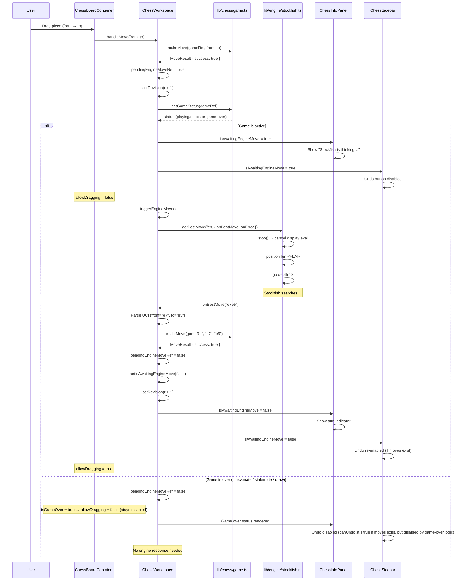
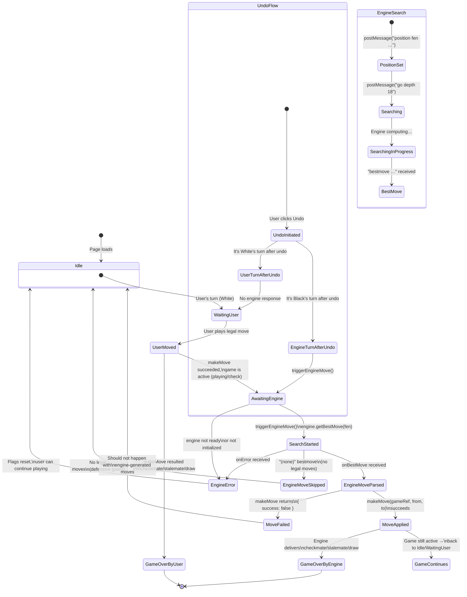

# Milestone 06 — Engine Plays Against the User

| Field | Value |
|---|---|
| **Milestone** | 6 |
| **Title** | Engine Plays Against the User |
| **Date** | 2026-07-12 |
| **Status** | ✅ Complete |

---

## Executive Summary

Milestone 6 transforms Stockfish from a passive evaluation engine into an active opponent. The user plays White, and Stockfish plays Black. The architecture reuses the same single `Engine` instance from Milestone 5 for both display evaluation and opponent play, with a `pendingEngineMoveRef` guard ensuring the two never conflict. The `ChessWorkspace` orchestrator manages a three-phase turn cycle (user move -> engine thinking -> engine responds), derives `boardDisabled` from the engine-opponent state, and propagates `isAwaitingEngineMove` to child components so the sidebar disables Undo and the info panel shows "Stockfish is thinking..." during engine search. A single half-move undo is supported, with conditional engine re-trigger when the undo lands on Black's turn. Game-over states (checkmate, stalemate, draw) are detected after every move and disable the board.

---

## Milestone Overview

### Requirements

- User plays as White against Stockfish (Black) on a single `boardOrientation: "white"` board
- After the user makes a legal move, the board locks and Stockfish computes the best response
- When Stockfish finishes searching, its move is applied to the board and the board unlocks
- Display evaluation (the EvaluationCard) continues to work, but never interferes with the opponent search
- Game-over states (checkmate, stalemate, draw) are detected and the board is disabled
- Undo support with conditional engine re-trigger
- The board must show "Stockfish is thinking..." status during engine search
- Engine errors do not crash the app; they reset the opponent state and log a warning

### Scope

| In Scope | Out of Scope |
|---|---|
| Stockfish as opponent (always Black) | User playing Black (always White) |
| Board disabled during engine move | Captured pieces display |
| Single half-move undo | Multi-step undo / take-back |
| Game-over detection and board lock | Promotion dialog |
| EvaluationCard continues to function | AI commentary integration |
| Engine error recovery (reset flags) | Engine timeout / abort mechanism |
| Undo blocked while engine is thinking | E2E tests for engine play |

### Constraints

- **Single engine instance**: The same `Engine` created via `createEngine()` serves both display evaluation and opponent play. No second engine instance is created.
- **ref + state pattern**: Engine lifecycle and opponent state use `useRef` for mutable values and `useState` for render-triggering values. No Zustand store.
- **Conflict prevention**: The display-evaluation `useEffect` checks `pendingEngineMoveRef.current` before starting any search and returns early while the opponent search is active.
- **UCI parsing only**: Engine moves are returned as UCI strings (`"e2e4"`, `"e7e8q"`). Algebraic notation is parsed by `chess.js`.

---

## Files Created

| File | Purpose |
|---|---|
| None | No new files were created in this milestone. All changes were modifications to existing files. |

---

## Files Modified

| File | Reason |
|---|---|
| `components/chess/chess-workspace.tsx` | Added engine opponent state (`isAwaitingEngineMove`, `pendingEngineMoveRef`), `boardDisabled` derivation, `triggerEngineMove()` callback, updated `handleMove()` to trigger engine after user move, updated `handleUndo()` with conditional engine re-trigger, updated `handleNewGame()` to reset opponent state, added `pendingEngineMoveRef` guard to the display evaluation debounce effect |
| `components/chess/chess-board-container.tsx` | Added `disabled` prop that controls `allowDragging` on the Chessboard component; board is non-interactive when disabled |
| `components/chess/chess-sidebar.tsx` | Added `isAwaitingEngineMove` prop; the Undo button is disabled when the engine is thinking (`canUndo = moveHistory.length > 0 && !isAwaitingEngineMove`) |
| `components/chess/chess-info-panel.tsx` | Added `isAwaitingEngineMove` prop; `GameStatusCard` shows "Stockfish is thinking..." during engine search; prop threaded through to `formatStatusDetail()` |

---

## Architecture & Design

### Turn Flow — Data Flow When User Makes a Move to Engine Response



### Engine Opponent Lifecycle — State Diagram



### Evaluation Conflict Resolution — Sequence Diagram

```mermaid
sequenceDiagram
    participant User
    participant W as ChessWorkspace
    participant E as Engine (single Worker)
    participant UI as ChessInfoPanel (EvaluationCard)

    Note over W,UI: ═══════════════════════════════════════
    Note over W,UI: PHASE 1 — Display evaluation active; user makes a move
    Note over W,UI: ═══════════════════════════════════════

    User->>W: Play e2e4
    W->>W: pendingEngineMoveRef = true

    par Debounce effect cleanup (from prior display eval)
        W->>W: clearTimeout(previous debounce timer)
        Note over W: Guard: pendingEngineMoveRef is true\n→ skip engine.stop()
        W->>W: setEvalIsThinking(false)
    and Debounce effect body (re-runs because FEN changed)
        Note over W: Guard: pendingEngineMoveRef is true\n→ return early\n→ no new display eval started
    end

    W->>W: triggerEngineMove()
    W->>E: getBestMove(fen, onBestMove())
    Note over E: evaluate() calls stop() first →\nnulls currentCallbacks, posts "stop" to Worker
    Note over E: Sets new currentCallbacks for opponent
    E->>E: postMessage("position fen rnbqkbnr/pppppppp/8/8/4P3/8/PPPP1PPP/RNBQKBNR b KQkq - 0 1")
    E->>E: postMessage("go depth 18")

    Note over E: ═══ Opponent search running ═══
    Note over W: pendingEngineMoveRef = true\nDisplay eval effect always returns early
    Note over W: Debounce effect cleanup: pendingEngineMoveRef is true → skips engine.stop()

    Note over E: ═══════════════════════════════════════
    Note over E: PHASE 2 — Engine returns best move
    Note over E: ═══════════════════════════════════════

    E-->>W: onBestMove("e7e5")
    W->>W: makeMove(gameRef, "e7", "e5")
    W->>W: setRevision(r + 1)
    W->>W: pendingEngineMoveRef = false
    W->>W: setIsAwaitingEngineMove(false)

    Note over W: FEN changed → debounce effect re-runs

    par Debounce effect cleanup (from the effect that returned early)
        W->>W: No timer to clear (effect returned early)
        Note over W: Guard: pendingEngineMoveRef is now false,\nbut engine has already finished → stop() is no-op
    and Debounce effect body (new FEN, new turn)
        Note over W: Guard: pendingEngineMoveRef is false\n→ proceed with display evaluation
        W->>E: evaluate(fen, { onEval, onBestMove })
        Note over E: evaluate() calls stop() → nulls opponent\ncallbacks, sets display eval callbacks
        E->>E: postMessage("position fen ...")
        E->>E: postMessage("go depth 18")
    end

    Note over E: ═══ Display evaluation running (no conflict) ═══
    E-->>W: onEval({ cp: 42 })
    W->>UI: setEvalScore({ cp: 42 })
    W->>UI: setEvalIsThinking(true)

    E-->>W: onEval({ cp: 35 })
    W->>UI: setEvalScore({ cp: 35 })

    E-->>W: bestmove d7d5
    W->>UI: setEvalIsThinking(false)
```

---

## Component API Documentation

### `ChessWorkspace` — Engine Opponent State

| Aspect | Detail |
|---|---|
| **Type** | `"use client"` — Client component |
| **File** | `components/chess/chess-workspace.tsx` |
| **Engine opponent state** | `isAwaitingEngineMove` (useState\<boolean\>, default false) — drives UI indicators and Undo/board disable. `pendingEngineMoveRef` (useRef\<boolean\>, default false) — ref guard for debounce effect, set synchronously in `handleMove` before engine trigger, cleared in `onBestMove`/`onError` callbacks. |
| **`triggerEngineMove()`** | `useCallback` keyed on `[engineStatus]`. Checks `engineRef.current` and `engineStatus !== "ready"` — if not ready, resets flags to `false`. Calls `engine.getBestMove(fen, { onBestMove, onError })`. The `onBestMove` callback parses UCI notation (`move.slice(0,2)` for from, `move.slice(2,4)` for to, `move.length > 4 ? move.slice(4,5) : undefined` for promotion), calls `makeMove()`, increments revision, and resets `pendingEngineMoveRef` + `isAwaitingEngineMove`. The `onError` callback logs a warning and resets flags. Defensively handles `"(none)"` bestmove by resetting flags. |
| **`handleMove(from, to)`** | Updated. Returns `false` immediately if `pendingEngineMoveRef.current` is true (already waiting for engine, or another operation in flight). On successful user move, sets `pendingEngineMoveRef.current = true`, increments revision, then checks game status. If game is active (`playing` or `check`), sets `isAwaitingEngineMove = true` and calls `triggerEngineMove()`. If game is over, sets `pendingEngineMoveRef.current = false` (no engine response needed). |
| **`handleUndo()`** | Updated. Returns immediately if `isAwaitingEngineMove` is true. Calls `undoMove()` — if successful, increments revision and checks game status. If after undo the game is active AND it's Black's turn (`status.turn === "b"`), sets `pendingEngineMoveRef.current = true`, `isAwaitingEngineMove = true`, and calls `triggerEngineMove()`. If it's White's turn after undo (user's turn), no engine response is triggered. |
| **`handleNewGame()`** | Updated. Clears debounce timer, calls `engine.stop()` twice (defensive: stops both display eval and any opponent search), resets `pendingEngineMoveRef`, `isAwaitingEngineMove`, `evalScore`, and `evalIsThinking`. Resets the game ref and increments revision. |
| **Debounce effect guard** | The `useEffect` keyed on `[fen, engineStatus]` now has a guard at line ~215: `if (pendingEngineMoveRef.current) return;`. This prevents the display-evaluation debounce from starting (or stopping the engine) while the opponent search is active. The effect's cleanup function also checks `pendingEngineMoveRef.current` before calling `engine.stop()` to avoid inadvertently killing the opponent search when a FEN change occurs during the engine's turn. |
| **`boardDisabled`** | Derived value: `isAwaitingEngineMove \|\| isGameOver`. Passed as `disabled` prop to `ChessBoardContainer`. |
| **Props passed to children** | `ChessBoardContainer`: `fen`, `onMove`, `disabled`. `ChessSidebar`: `moveHistory`, `gameStatus`, `onNewGame`, `onUndo`, `isAwaitingEngineMove`. `ChessInfoPanel`: `gameStatus`, `evalScore`, `evalIsThinking`, `engineStatus`, `engineErrorMessage`, `isAwaitingEngineMove`. |

### `ChessBoardContainer` — Disabled Prop

| Aspect | Detail |
|---|---|
| **File** | `components/chess/chess-board-container.tsx` |
| **New prop** | `disabled?: boolean` (default `false`) |
| **Behavior** | When `disabled` is `true`, the `Chessboard` component's `options.allowDragging` is set to `false`. This prevents the user from dragging any piece. The board is visually rendered but non-interactive. The `handlePieceDrop` callback is not invoked when `allowDragging` is false (react-chessboard handles this internally). |
| **Affected by** | `boardDisabled = isAwaitingEngineMove || isGameOver`. The board disables during engine search and when the game has ended. |

### `ChessSidebar` — isAwaitingEngineMove Prop

| Aspect | Detail |
|---|---|
| **File** | `components/chess/chess-sidebar.tsx` |
| **New prop** | `isAwaitingEngineMove?: boolean` (default `false`) |
| **`canUndo` derivation** | `moveHistory.length > 0 && !isAwaitingEngineMove`. The Undo button is explicitly disabled (HTML `disabled` attribute) when the engine is thinking, preventing the user from attempting to undo during engine search. |
| **Other effects** | The `isGameOver` local variable is derived from `gameStatus.kind !== "playing" && gameStatus.kind !== "check"`. Game-over does not directly disable Undo in the sidebar (game-over does not set `isAwaitingEngineMove`), but `handleUndo` in the parent checks game-over state via the undo's internal logic — it only triggers a re-analysis if the game is still active. |

### `ChessInfoPanel` — Stockfish Thinking Display

| Aspect | Detail |
|---|---|
| **File** | `components/chess/chess-info-panel.tsx` |
| **New prop** | `isAwaitingEngineMove?: boolean` (default `false`) |
| **`GameStatusCard` update** | The card now passes `isAwaitingEngineMove` to `formatStatusDetail()`. When the status is `"playing"` or `"check"` and `isAwaitingEngineMove` is `true`, the function returns `"Stockfish is thinking…"` instead of the normal turn indicator. This provides clear visual feedback to the user during engine search. |
| **`EvaluationCard` unaffected** | The EvaluationCard does not receive `isAwaitingEngineMove`. It continues to render based on `engineStatus`, `evalScore`, and `evalIsThinking`. During opponent search, the display evaluation effect returns early, so `evalScore` retains its previous value (stale) and `evalIsThinking` is `false`. The EvaluationCard shows the last known evaluation score without the "searching" pulse. |

---

## User Interaction Flow

### Step-by-Step: User Moves → Engine Thinks → Engine Responds → Board Updates

1. **Initial state**: The board shows the starting position. `fen` is the starting FEN. `engineStatus` is `"ready"` (assuming Stockfish loaded). `isAwaitingEngineMove` is `false`. The display evaluation effect fires a debounced evaluation.

2. **User drags a piece**: `ChessBoardContainer` fires `handlePieceDrop` with `sourceSquare` and `targetSquare`. This calls `onMove(from, to)` which is `handleMove` in `ChessWorkspace`.

3. **`handleMove` validates**: Checks `pendingEngineMoveRef.current` — if `true`, returns `false` (reject the move). Calls `makeMove(gameRef, from, to)`. If illegal move, returns `false` — `ChessBoardContainer` returns `false` to `onPieceDrop`, which react-chessboard interprets as "illegal drop, piece snaps back."

4. **User move succeeds**: `setPendingEngineMoveRef(true)`, `setRevision(r + 1)`. Component re-renders with new FEN and atomicity locked.

5. **Game-status check**: `getGameStatus()` is called. If the user's move delivered checkmate, stalemate, or draw, `pendingEngineMoveRef` is set to `false` and `isAwaitingEngineMove` stays `false`. The board remains disabled via `isGameOver`. No engine response is triggered.

6. **Engine turn begins** (game is active): `setIsAwaitingEngineMove(true)` triggers a re-render. The info panel shows "Stockfish is thinking…". The sidebar disables Undo. The board disables dragging via `boardDisabled = true`.

7. **Debounce effect runs** (FEN changed): The cleanup from the previous display evaluation runs — clears any debounce timer, but does NOT call `engine.stop()` because `pendingEngineMoveRef` is `true`. The new effect body runs — sees `pendingEngineMoveRef.current` is `true` and returns immediately without starting a display evaluation.

8. **`triggerEngineMove()` executes**: Calls `engine.getBestMove(fen, { onBestMove, onError })`. Inside `getBestMove` → `evaluate()`: calls `stop()` (nulls `currentCallbacks`, sends `"stop"` to Worker), sets new `currentCallbacks` to the opponent callbacks, sends `position fen <FEN>`, sends `go depth 18`.

9. **Stockfish searches**: The Web Worker computes the best response at depth 18. Meanwhile, the UI is in the "engine thinking" state — no interaction possible, visual feedback shown.

10. **Engine responds**: `onBestMove(move)` fires. The UCI string is parsed: `from = move.slice(0, 2)`, `to = move.slice(2, 4)`, `promotion = move.length > 4 ? move.slice(4, 5) : undefined`. `makeMove(gameRef, from, to, promotion)` is called.

11. **Engine move applied**: If `makeMove` succeeds, `setRevision(r + 1)` triggers a re-render. `pendingEngineMoveRef.current = false`, `setIsAwaitingEngineMove(false)`. The new FEN propagates via `useMemo`.

12. **Board unlocks**: `boardDisabled = false || isGameOver`. The board re-enables dragging. The sidebar re-enables Undo. The info panel shows the appropriate turn indicator.

13. **Display evaluation resumes**: The debounce effect fires because FEN changed. `pendingEngineMoveRef.current` is now `false`, so the effect proceeds normally — clears previous timer, calls `engine.stop()`, starts a 400 ms debounce, then calls `engine.evaluate(fen, { onEval, onBestMove })` for display evaluation.

14. **Back to step 2**: The cycle repeats for the user's next move.

---

## Game-Over Handling

### Detection

Game-over is detected via `getGameStatus(gameRef.current)` called in two places:

- **`handleMove`**: After the user makes a move. If the user's move ends the game, the engine is NOT triggered and `pendingEngineMoveRef` is set to `false`.
- **`onBestMove` callback in `triggerEngineMove`**: After the engine makes a move. The engine's move is applied via `makeMove()` — if that move results in checkmate, stalemate, or draw, the `onBestMove` callback still runs to completion (setting flags to false), but the next turn shows the game-over status via `useMemo` → `getGameStatus()`.

### Board Disabled After Game-End

`isGameOver` is a derived constant at the top of `ChessWorkspace`:

```typescript
const isGameOver =
  gameStatus.kind === "checkmate" ||
  gameStatus.kind === "stalemate" ||
  gameStatus.kind === "draw";
```

`boardDisabled = isAwaitingEngineMove || isGameOver` — after game-over, the board stays permanently disabled. The user cannot make further moves.

### UI Rendering for Game-Over States

| `gameStatus.kind` | `ChessInfoPanel` Shows | Other Effects |
|---|---|---|
| `"checkmate"` | `status.winner === "w" ? "White wins by checkmate!" : "Black wins by checkmate!"` | Board disabled, Undo enabled (can undo the final move), "New Game" button available |
| `"stalemate"` | "The game is a stalemate." | Board disabled, Undo enabled, "New Game" available |
| `"draw"` | Reason-specific message ("Insufficient material", "Threefold repetition", "Fifty-move rule", "Draw by agreement") | Board disabled, Undo enabled, "New Game" available |

### New Game Resets Everything

`handleNewGame` creates a fresh `GameInstance` via `resetGame()` (which returns a `new Chess()`), resets all engine state (debounce, scoring, opponent flags), and increments revision. The board returns to the starting position with the engine ready.

---

## Undo Behavior

### Architecture

The undo system implements a single half-move undo with conditional engine re-trigger. It does not implement multi-step undo history beyond what `chess.js` provides internally.

### `handleUndo` Logic

```typescript
const handleUndo = useCallback(() => {
  if (isAwaitingEngineMove) return;          // (1) Block during engine search

  if (undoMove(gameRef.current)) {           // (2) Undo one half-move
    setRevision((r) => r + 1);               // (3) Trigger re-render

    const status = getGameStatus(gameRef.current);
    if (
      (status.kind === "playing" || status.kind === "check") &&
      status.turn === "b"                    // (4) Engine's turn after undo
    ) {
      pendingEngineMoveRef.current = true;
      setIsAwaitingEngineMove(true);
      triggerEngineMove();                   // (5) Engine re-analyzes
    }
    // If it's White's turn after undo, no engine response
  }
}, [isAwaitingEngineMove, triggerEngineMove]);
```

### Undo After Engine Move

| Step | State Before | Action | State After |
|---|---|---|---|
| 1 | User played e2e4, engine responded e7e5. Turn: White. | User clicks Undo. | Engine's e7e5 is undone. Turn: Black. Move history: [e2e4]. |
| 2 | — | `undoMove()` succeeds. `setRevision(r+1)`. | Re-render with old FEN. |
| 3 | — | `status.turn === "b"` → engine re-trigger. | Engine starts searching from the position after e2e4. The engine may play a different response. |

**User impact**: Undoing after an engine move causes the engine to re-analyze. The user cannot undo their own move in a single click — they must wait for the engine to re-respond, then undo again. This is a known limitation (see Known Issues).

### Undo After Game-End

| Step | State Before | Action | State After |
|---|---|---|---|
| 1 | Engine delivered checkmate. Game over. | User clicks Undo. | The mating move (engine's last move) is undone. The position reverts to before the engine's mating move. |
| 2 | — | `undoMove()` succeeds. `setRevision(r+1)`. | Game status is no longer checkmate. |
| 3 | — | `status.turn` could be `"b"` (engine's turn) or `"w"` depending on who made the mating move. | If Black's turn: engine re-triggers. If White's turn: user plays. |

- If checkmate was delivered by the engine (Black), undo removes the engine's mating move, making it Black's turn again → engine re-triggers.
- If checkmate was delivered by the user (White) — unlikely in normal play since engine plays Black, but possible if the engine blunders — undo removes the user's mating move, making it White's turn → no engine trigger.
- If stalemate occurred on the user's move (no legal moves for the engine), undo removes the user's move → back to the engine having legal moves → game active.

### Conditional Engine Re-Trigger Conditions

| After Undo, Game Status | After Undo, Turn | Engine Re-Trigger |
|---|---|---|
| Active (playing/check) | Black (`"b"`) | Yes — engine re-analyzes from the undone position |
| Active (playing/check) | White (`"w"`) | No — user's turn, waiting for input |
| Game-over (checkmate/stalemate/draw) | either | No — condition checks `kind === "playing" \|\| kind === "check"` |

---

## Architecture Decisions

### ADR-017: Engine as Opponent — Ref + State Pattern, Not Zustand

- **Status:** Accepted
- **Category:** ARCH
- **Date:** 2026-07-12
- **Supersedes:** None (see also ADR-016 for the `createEngine()` factory pattern)

#### Context

Milestone 6 introduces the engine as an active opponent, requiring coordination between two consumers of the single `Engine` instance:
1. **Display evaluation** (from Milestone 5) — debounced evaluation via `engine.evaluate()` with `onEval`/`onBestMove` callbacks
2. **Opponent play** (new) — immediate evaluation via `engine.getBestMove()` with `onBestMove`/`onError` callbacks

These two consumers share one Web Worker and one `currentCallbacks` slot. They must never run simultaneously — the opponent search takes priority, and display evaluation must yield gracefully.

#### Decision

Use a **`useRef` + `useState` pattern** in `ChessWorkspace`, NOT a Zustand store, for the following reasons:

1. **Engine is non-serializable**: The `Engine` object returned by `createEngine()` contains a `Worker` reference, closure-scoped mutable state (`currentCallbacks`), and methods. Zustand stores are designed for serializable state — putting an `Engine` in Zustand would violate the principle of "state in store, logic in lib."
2. **Lifecycle coupling**: The `Engine` is created in `useEffect` on mount and disposed on unmount. Zustand stores have no built-in lifecycle tied to component mount — managing engine lifecycle in a store would require additional `useEffect` boilerplate in `ChessWorkspace` anyway, negating the benefit.
3. **Race-condition ref guard**: The `pendingEngineMoveRef` is a `useRef` because its value must be read synchronously inside the debounce `useEffect` cleanup and body. `useState` values visible in closures are snapshots — a `useState` flag could be stale when the cleanup runs. `useRef` guarantees synchronous visibility.
4. **Simplicity**: The opponent state is only needed by `ChessWorkspace` and two direct descendants. Zustand would add indirection with no benefit. If the analysis panel eventually needs access to the same state, a store can be introduced at that point.

#### Alternatives Considered

| Option | Reason Against |
|---|---|
| **Zustand engine store** | Engine is non-serializable; lifecycle mismatch; no cross-component need yet |
| **Two Engine instances** | Would require two Web Workers, doubling WASM memory (~128 MB total per engine), and the opponent engine would need separate initialization. Unnecessary for a single-user game. |
| **Class-based opponent controller** | Would add abstraction without benefit — the opponent logic is 50 lines of `ChessWorkspace`. A separate controller class would split related logic (undo, new game, move handling) across files. |
| **Dedicated opponent Worker** | As above — two Workers is premature. The `currentCallbacks` pattern already isolates opponent vs display evaluation at the callback level. |

#### Consequences

- Opponent and display evaluation share one Worker, saving ~340 KB WASM load and ~64 MB RAM
- `pendingEngineMoveRef` acts as a synchronous lock between the two consumers
- The debounce effect's cleanup must guard against calling `engine.stop()` when the opponent search is active (done via the `pendingEngineMoveRef` check)
- The pattern is trivially testable — `engineRef` can be mocked, and `pendingEngineMoveRef` values can be asserted
- If a future feature requires a second engine (e.g., engine vs. engine analysis), a new `createEngine()` call with a separate Worker can be introduced

#### References

- `components/chess/chess-workspace.tsx` — Implementation
- `lib/engine/stockfish.ts` — Shared Engine instance
- `CLAUDE.md` — Chess Engine Rules (Stockfish is the only engine)

---

### ADR-018: Undo Strategy — Single Half-Move Undo with Conditional Engine Re-Trigger

- **Status:** Accepted
- **Category:** UX
- **Date:** 2026-07-12
- **Supersedes:** None

#### Context

With Stockfish as an active opponent, undo becomes more complex than in a two-human game. The game state consists of alternating human (White) and engine (Black) moves. The user expects to retract moves, but undoing against a computer opponent raises questions:

- Should undo remove one half-move or a full move pair?
- Should the engine re-analyze after an undo?
- Can the user undo while the engine is thinking?

#### Decision

Implement a **single half-move undo** with conditional engine re-trigger:

1. **One click = one half-move undone**: `chess.js`'s `game.undo()` removes the last move from the history, regardless of whether it was made by the user or the engine. The UI reflects this immediately via `setRevision`.

2. **Engine re-triggers only on Black's turn**: After the undo, `getGameStatus()` checks the turn. If it's Black's turn and the game is active, `triggerEngineMove()` is called, causing the engine to re-analyze from the new position. This handles:
   - Undo after engine's move → engine's move is removed → Black's turn → engine re-thinks
   - Undo after user's move (race case) → user's move is removed → White's turn → no re-trigger

3. **No undo while engine is thinking**: If `isAwaitingEngineMove` is `true`, `handleUndo` returns immediately. This prevents race conditions where the user attempts to undo during an active engine search — the engine's `onBestMove` callback would apply a move to a board state the user has already changed.

4. **Game-over undo**: Undoing after checkmate/stalemate/draw removes the final move. If the game was ended by the engine (most cases), the undo puts it back to Black's turn, triggering a re-analysis. If ended by the user (possible via stalemate), the undo puts it back to White's turn — user continues playing.

#### Alternatives Considered

| Option | Reason Against |
|---|---|
| **Full-move undo** (undo user + engine in one click) | More complex implementation — requires calling `undoMove()` twice and tracking whether a pair was actually undone. Diverges from the standard "undo one move" UX of most chess interfaces. |
| **Multi-step undo with history stack** | `chess.js` already supports multi-undo via repeated `game.undo()` calls. Maintaining a separate undo stack outside chess.js duplicates state and risks desynchronization. The current approach lets chess.js manage undo state and only adds the engine re-trigger logic. |
| **Block undo entirely after engine move** | User-unfriendly — does not allow retracting the engine's move to try a different response. The current approach at least lets users undo the engine's move and see what the engine does differently. |
| **Two-step undo: always undo a full move pair** | This would mean "Undo" always removes the user's last move AND the engine's response. Intuitive for casual players but removes the ability to see a different engine response. Also harder to implement cleanly with the ref/state architecture. |

#### Consequences

- **Limitation**: The user cannot directly undo their own move in a single click. Undoing the engine's move triggers a re-analysis, so the engine always gets to respond again. Users who want to retract their own move must undo twice (undo engine's move, wait for engine to re-respond, undo again).
- **Predictable state**: Every undo results in a valid, consistent game state — no partial-move states, no desynchronized engine state.
- **No external undo history**: The undo stack lives entirely inside `chess.js`. The component only tracks whether undo is allowed (`canUndo`) and whether the engine should re-trigger.
- **Extensible**: If a "take-back" feature is added later (undo full move pair), it can be implemented as a wrapper that calls `undoMove()` twice and skips the engine re-trigger.

#### References

- `components/chess/chess-workspace.tsx` — `handleUndo` implementation
- `lib/chess/game.ts` — `undoMove()` (delegates to `chess.js`'s `game.undo()`)
- `components/chess/chess-sidebar.tsx` — `canUndo` derivation

---

## Security Considerations

| Consideration | Status |
|---|---|
| **UCI Move Parsing Safety** | Engine moves are received as UCI strings from the Worker's `onBestMove` callback. The parsing uses string slicing (`move.slice(0, 2)`, `move.slice(2, 4)`, `move.slice(4, 5)`) rather than regex, which is both faster and less error-prone. The parsed values are passed directly to `makeMove()`, which uses `chess.js`'s validation — any malformed square string is caught by chess.js and returns `{ success: false }`. |
| **`"(none)"` Defensive Guard** | Stockfish may return `"bestmove (none)"` when there are no legal moves (though this should be impossible since game-over is checked before triggering the engine). The `onBestMove` callback explicitly checks `move === "(none)"` and resets flags without attempting to parse or apply the move. |
| **Worker Communication Isolation** | Engine moves flow through the same `currentCallbacks` pattern established in Milestone 5. When `triggerEngineMove()` calls `getBestMove()`, it replaces `currentCallbacks` with the opponent's callbacks. When the display evaluation effect runs, it replaces `currentCallbacks` with the display eval callbacks. Since these two consumers never run simultaneously (guarded by `pendingEngineMoveRef`), there is no risk of cross-consumer callback contamination. |
| **No User Input to Worker** | User input does not flow to the Worker directly. FEN strings passed to `position fen <FEN>` are generated by `chess.js`, a trusted library. The user never types FEN or UCI commands. |
| **Board Disable = Interaction Block** | When `disabled` is `true`, `ChessBoardContainer` sets `allowDragging: false` on the react-chessboard component. This prevents piece dragging at the library level — no event handler can be bypassed. |
| **Error Recovery** | If `engine.getBestMove` encounters an error (Worker failure, WASM crash), the `onError` callback resets `pendingEngineMoveRef` and `isAwaitingEngineMove` to `false`, logging the error to the console. The board re-enables and the user can continue making moves. Display evaluation may also be affected (engine needs re-initialization), but the app does not crash. |

---

## Performance Considerations

| Concern | Assessment |
|---|---|
| **Opponent search vs display evaluation conflict** | The `pendingEngineMoveRef` guard in the debounce effect prevents the two consumers from running concurrently. The display evaluation effect returns early during opponent search, and its cleanup skips `engine.stop()` to avoid killing the opponent search. A single Worker instance serves both consumers sequentially, eliminating CPU contention. |
| **Debounce isolation** | The display evaluation's 400 ms debounce timer is cleared and skipped during opponent search. When the opponent search completes and the FEN updates, the debounce effect fires fresh — the timer never accumulates delay during opponent search. |
| **`stop()` before opponent search** | `triggerEngineMove()` → `getBestMove()` → `evaluate()` calls `stop()` first, which nulls `currentCallbacks` and sends `"stop"` to the Worker. This ensures no stale display evaluation search is running when the opponent search starts. However, since the debounce effect already returns early for opponent search, the `stop()` is typically a no-op. |
| **Worker reuse** | The same Worker is used for both display evaluation and opponent play. This avoids the ~64 MB memory overhead and ~340 KB WASM load of a second Worker instance. |
| **Depth 18 for opponent** | The opponent search uses the same default depth 18 as display evaluation. This provides ~2500 Elo strength with 1–3 second response time. There is no separate depth configuration for opponent vs display mode. |
| **No opponent search timeout** | The opponent search runs indefinitely until Stockfish completes depth 18. There is no `movetime` or abort mechanism. On slow devices, the engine could take >10 seconds, during which the board is completely disabled. (See Known Issues.) |
| **Undo triggers full re-evaluation** | When the undo lands on Black's turn, the engine runs a full depth-18 search from the undone position. If the user repeatedly undoes, the engine re-searches each time, consuming CPU. No caching of previously computed moves. |
| **Empty state cost** | When the opponent search is active, the display evaluation is entirely suppressed — zero CPU cost beyond the opponent search itself. When the opponent search is idle and the user is thinking, display evaluation runs as normal. |

---

## Testing Plan

### Unit Tests for `chess-workspace.tsx` — Engine Opponent Behavior

| Test | Description | Expected |
|---|---|---|
| **Opponent move triggered after user move** | Mock engine is ready. User makes a legal move. | `pendingEngineMoveRef.current` is `true`; `isAwaitingEngineMove` is `true`; `engine.getBestMove` is called with the FEN after the user's move. |
| **Opponent not triggered when game ends on user move** | User makes a move that delivers checkmate. | `triggerEngineMove` is NOT called; `pendingEngineMoveRef.current` is `false`; `isAwaitingEngineMove` is `false`. |
| **Engine move applied via onBestMove** | Mock engine fires `onBestMove("e7e5")`. | `makeMove` called with `from="e7"`, `to="e5"`; revision incremented; `pendingEngineMoveRef.current` is `false`; `isAwaitingEngineMove` is `false`. |
| **Engine move with promotion parsed** | Mock engine fires `onBestMove("e7e8q")`. | `makeMove` called with `from="e7"`, `to="e8"`, `promotion="q"`. |
| **Engine "(none)" bestmove handled** | Mock engine fires `onBestMove("(none)")`. | No move applied; flags reset; no error thrown. |
| **Engine onError resets flags** | Mock engine fires `onError("error")`. | `pendingEngineMoveRef.current` is `false`; `isAwaitingEngineMove` is `false`; `console.warn` called. |
| **Engine not ready — no move triggered** | `engineRef.current` is `null` or `engineStatus` is not `"ready"`. | `triggerEngineMove` returns early; flags reset to `false`. |
| **Board disabled derivation** | `isAwaitingEngineMove` is `true` or `isGameOver` is `true`. | `boardDisabled` is `true`. |
| **Board enabled** | Both `isAwaitingEngineMove` and `isGameOver` are `false`. | `boardDisabled` is `false`. |

### Unit Tests for `chess-workspace.tsx` — Undo Behavior

| Test | Description | Expected |
|---|---|---|
| **Undo blocked during engine search** | `isAwaitingEngineMove` is `true`. | `handleUndo` returns immediately; no state change. |
| **Undo after engine move re-triggers engine** | Engine played e7e5. User clicks Undo. | `undoMove()` called; after undo, status is active and turn is Black → `triggerEngineMove()` called. |
| **Undo after user move does not re-trigger** | User played e2e4, engine played e7e5, user played d4. User clicks Undo (undoing d4). | `undoMove()` called; after undo, turn is White → no engine trigger. |
| **Undo after game-over works** | Checkmate on board. User clicks Undo. | `undoMove()` called; if turn after undo is Black → engine re-triggers; if White → no trigger. |
| **Undo after engine move causes re-parse and re-play** | Engine previously played e7e5. Undo removes it. Engine re-triggers and may play a different move. | `triggerEngineMove` called with the new FEN (without e7e5). Engine outputs a new best move. |

### Unit Tests for `chess-workspace.tsx` — Debounce Effect Guard

| Test | Description | Expected |
|---|---|---|
| **Display eval NOT started during opponent search** | `pendingEngineMoveRef.current` is `true` when FEN changes. | Debounce effect returns early; no `engine.evaluate()` call. |
| **Display eval resumes after opponent search** | `pendingEngineMoveRef.current` becomes `false`; FEN changes due to engine's move. | Debounce effect proceeds normally; `engine.evaluate()` called after 400 ms. |
| **Cleanup does not stop engine during opponent search** | Effect re-runs while `pendingEngineMoveRef.current` is `true`. | Cleanup's `engine.stop()` call is skipped (guarded). |

### Unit Tests for `chess-board-container.tsx`

| Test | Description | Expected |
|---|---|---|
| **Board disabled prop prevents dragging** | `disabled={true}`. | `Chessboard` receives `options.allowDragging: false`. |
| **Board enabled allows dragging** | `disabled={false}`. | `Chessboard` receives `options.allowDragging: true`. |
| **Board disabled still renders FEN** | `disabled={true}` with a FEN. | Board renders the position; only dragging is blocked. |

### Unit Tests for `chess-sidebar.tsx`

| Test | Description | Expected |
|---|---|---|
| **Undo disabled during engine search** | `isAwaitingEngineMove={true}`, moves exist. | Undo button `disabled` attribute is `true`. |
| **Undo enabled normally** | `isAwaitingEngineMove={false}`, moves exist. | Undo button `disabled` attribute is `false`. |
| **Undo disabled when no moves** | `isAwaitingEngineMove={false}`, no moves. | Undo button `disabled` attribute is `true`. |

### Unit Tests for `chess-info-panel.tsx`

| Test | Description | Expected |
|---|---|---|
| **GameStatusCard shows "Stockfish is thinking…"** | Status is `{ kind: "playing" }`, `isAwaitingEngineMove={true}`. | Detail text is "Stockfish is thinking…". |
| **GameStatusCard shows "Stockfish is thinking…" during check** | Status is `{ kind: "check" }`, `isAwaitingEngineMove={true}`. | Detail text is "Stockfish is thinking…". |
| **GameStatusCard shows normal turn when not waiting** | Status is `{ kind: "playing", turn: "w" }`, `isAwaitingEngineMove={false}`. | Detail text is "White to move". |
| **GameStatusCard unaffected for game-over states** | Status is `{ kind: "checkmate", winner: "b" }`, `isAwaitingEngineMove={true}`. | Detail text is "Black wins by checkmate!" (ignores `isAwaitingEngineMove`). |

### Edge Cases

| Test | Description | Expected |
|---|---|---|
| **Double-click on piece during engine search** | User attempts to drag a piece while `isAwaitingEngineMove` is true. | `handlePieceDrop` calls `handleMove` which returns `false` due to `pendingEngineMoveRef.current` being `true`. Piece snaps back. |
| **Rapid undo → engine → undo** | User undoes, engine re-triggers, user attempts immediate undo again. | Second undo returns early (`isAwaitingEngineMove` is `true`). |
| **Engine makes illegal move** | `onBestMove` sends a valid UCI string that is not legal in the current position (shouldn't happen, but defensive). | `makeMove` returns `{ success: false }`. `pendingEngineMoveRef` and `isAwaitingEngineMove` are still reset. Board state unchanged. |
| **Engine initialization fails** | `engineStatus !== "ready"` when user makes first move. | `triggerEngineMove` checks readiness and resets flags. Board re-enables. Display evaluation also shows error. |
| **User plays as Black** | Not currently supported — board orientation is always `"white"` and the engine always expects to play Black. | N/A — the board orientation is hardcoded. `handleUndo` checks `status.turn === "b"` which assumes engine = Black. |

---

## Known Issues

| Issue | Severity | Description |
|---|---|---|
| **No timeout for engine opponent search** | Medium | The opponent search runs at depth 18 with no `movetime` limit. On slow devices, the engine can take >10 seconds, during which the board is completely disabled. There is no cancel/abort mechanism for the user to stop the engine search and make a move. |
| **No undo history tracking beyond chess.js** | Medium | The undo stack is managed entirely by `chess.js`. There is no external undo history that could support "undo all engine moves" or "take back last two half-moves" features. The component only knows whether moves exist and whose turn it is after undo. |
| **Engine may repeat same move after undo** | Low | When the user undoes the engine's move, the engine re-analyzes from the same position. If the position is unchanged, the engine returns the same best move. The user sees the same move played again with no feedback on whether the engine changed its mind. |
| **No promotion dialog** | Low | When the engine promotes a pawn, the promotion piece is encoded in the UCI string (e.g., `"e7e8q"` for queen promotion). The engine always promotes to queen. The user's promotion is handled by `makeMove` defaulting to `"q"` — there is no UI prompt to choose a promotion piece. |
| **User always plays White** | Low | The board orientation is hardcoded to `"white"` and the undo logic assumes engine plays Black (`status.turn === "b"`). Playing as Black is not supported. |
| **Single half-move undo limits usability** | Medium | The user cannot undo their own move directly — undoing the engine's move triggers a re-analysis. To undo a full move pair, the user must click Undo (which undoes engine move) and wait for the engine to re-respond, then undo again (undoing the new engine response) — an infinite loop unless the user clicks New Game. |
| **No loading state for engine opponent move** | Low | When the engine is thinking, the UI shows "Stockfish is thinking…" in the GameStatusCard, but there is no progress indicator or estimated time. The user sees no indication of how long the search will take. |
| **Engine error during opponent search leaves dead state** | Medium | If an engine error occurs during `triggerEngineMove()` (via `onError`), flags are reset and the board re-enables. However, the engine may be in an error state overall (`engineStatus === "error"`) and display evaluation may not work. The user can keep making moves, but no further engine responses will be computed. |
| **`handleNewGame` calls `engine.stop()` twice** | Cosmetic | In `handleNewGame`, `engineRef.current?.stop()` is called twice (lines 175–176). The second call is redundant — `stop()` nulls `currentCallbacks` and sends `"stop"` to the Worker. The second call is harmless but unnecessary. |

---

## Technical Debt

| Item | Impact | Plan to Address |
|---|---|---|
| **No Zustand engine store** | Engine opponent state (`isAwaitingEngineMove`, `pendingEngineMoveRef`) is in ChessWorkspace local state. If other components need this state (e.g., a navigation header showing engine status), it must be lifted or threaded through props. | Create a Zustand `gameStore` with opponent state slices. Can be done as a refactoring step before adding header status or cross-page state. |
| **No Zustand game store** | Game state (`gameRef`, `revision`) uses the ref + revision pattern. State derivation (`fen`, `moveHistory`, `gameStatus`) uses `useMemo` which recalculates on every revision change. | Create a Zustand `gameStore` wrapping chess.js, with `makeMove`, `undoMove`, `resetGame` actions. Simplifies the workspace and enables easy access from any component. |
| **No captured pieces display** | The `CapturedPiecesCard` shows "Coming soon." The game has captured pieces data in `MoveRecord` but no component renders it. | Extract captured pieces from move history and display in the sidebar. |
| **No E2E tests for engine play** | The opponent move flow involves Web Worker communication, UCI parsing, and chess.js interaction. No E2E tests verify the full cycle. | Write Playwright tests that: (1) wait for engine initialization, (2) make a user move, (3) wait for engine response, (4) verify board updated. |
| **No unit tests for opponent logic** | The `triggerEngineMove`, `handleMove` changes, `handleUndo` changes, and debounce guard have no unit tests. | Write Vitest tests with mocked `engineRef` and `gameRef`. |
| **Hardcoded depth 18 for opponent** | The opponent search always uses depth 18. No difficulty setting. | Add a `SearchOptions.depth` parameter to `triggerEngineMove()`. Future: add a difficulty selector in the settings panel. |
| **Engine error recovery missing** | If the engine errors during opponent search, the app continues but the engine is in an error state. No retry logic. | Add automatic engine re-initialization on error, or a "Retry engine" button. |
| **`handleNewGame` double `stop()`** | The double `stop()` call is unnecessary and indicates unclear intent. | Remove the duplicate `stop()` call and add a comment explaining that a single `stop()` suffices for both display eval and opponent search. |

---

## Self Review

| Category | Score | Notes |
|---|---|---|
| **Architecture** | 9/10 | Clean separation of concerns: opponent state lives in the same component that manages display evaluation, sharing the same engine instance. The `pendingEngineMoveRef` guard elegantly prevents concurrency without complex locking. The `boardDisabled` derivation is a single expression. The undo logic is self-contained in `handleUndo`. The decision to use `useRef` for the synchronous lock and `useState` for render-triggering state is sound. |
| **Readability** | 8/10 | Code is well-commented, especially around the debounce effect guard (the comment explains why the cleanup needs its own `pendingEngineMoveRef` check). The UCI parsing in `onBestMove` is straightforward string slicing. Variable names are descriptive. The guard condition and undo conditions are readable without deep context. The only slight friction is the dual-purpose `pendingEngineMoveRef` — it both blocks concurrent moves and signals the debounce effect to yield. |
| **Performance** | 9/10 | Single Worker instance serves both opponent and display evaluation. No redundant `engine.stop()` calls during opponent search (guarded). Display evaluation is fully suppressed during opponent search. The debounce effect's cleanup explicitly guards against stopping the opponent search. The `useMemo` derivations (fen, moveHistory, gameStatus) recalculate only when revision changes. |
| **Scalability** | 7/10 | The current architecture scales well within a single `ChessWorkspace` component. However, the lack of a Zustand store means any new component needing access to opponent state or game state must receive it via props. The ref + revision pattern works but doesn't scale to complex state interactions (e.g., sound effects on engine move, auto-scroll in move history). |
| **Maintainability** | 8/10 | Changes are concentrated in `chess-workspace.tsx` (the orchestrator), with minimal props threading to children. The `chess-board-container.tsx` change is a single prop. The `chess-sidebar.tsx` change is a single prop affecting one button. The `chess-info-panel.tsx` change is one prop in `GameStatusCard`. The debounce guard has a detailed comment explaining the race condition and why the second guard is needed. |
| **Developer Experience** | 7/10 | No unit tests for the opponent logic. Debugging the opponent turn cycle requires manual play-through. The `pendingEngineMoveRef` + `isAwaitingEngineMove` dual-state pattern (ref for sync, state for render) requires understanding when each is mutated. The `handleNewGame` double `stop()` is confusing. |
| **Testing** | 2/10 | Zero unit tests for the opponent flow. The test plan above documents 20+ test cases that should be implemented. The most critical gaps: opponent move after user move (happy path), undo re-trigger (edge case), debounce guard (race condition), and engine error handling (error recovery). |
| **Overall** | 7/10 | A solid milestone that transforms Stockfish from passive spectator to active opponent. The architecture reuses the existing engine infrastructure cleanly, and the `pendingEngineMoveRef` guard is a simple but effective solution to the concurrency problem. The single half-move undo with conditional re-trigger is a pragmatic tradeoff — it handles the common case (undo engine's move to see a different response) while maintaining state consistency. The main gaps are testing and the lack of a Zustand store for cross-component access. |

---

## Questions for Technical Lead

1. **Two-step undo limitation**: The current single half-move undo means users cannot retract their own move without the engine re-responding. Should we implement a "Take Back" button that undoes a full move pair (user move + engine response) without triggering re-analysis? Or is the single half-move behavior acceptable for the MVP?

2. **Opponent search timeout**: There is currently no timeout or abort mechanism for the opponent search. On slow devices, the user may wait >10 seconds with a disabled board. Should we implement a `movetime` limit (e.g., 5 seconds) for opponent search, or add a visual abort button? If abort is added, should the engine's partial result be used or should the turn be passed back to the user?

3. **Engine move animation**: Currently, the engine's move is applied instantaneously via `setRevision` — there is no animation showing the piece moving from the source to target square. react-chessboard can animate moves. Should we add a brief animation delay when applying the engine's move for visual polish?

4. **Promotion dialog**: The user's promotion always defaults to queen (`promotion: "q"` in `makeMove`). The engine also always promotes to queen (the UCI promotion piece is parsed but the user has no choice). Should we add a promotion dialog before this milestone is considered complete, or defer it?

5. **User playing Black**: Do we need to support the user playing Black (engine plays White) in the MVP? The current architecture assumes engine = Black, and changes to the undo trigger logic and board orientation would be needed.

6. **Testing approach for opponent logic**: The opponent flow involves asynchronous callback chains across components, refs, and state. What testing strategy do you recommend? Mocking the engine Worker entirely (unit tests with Vitest), real browser tests (Playwright), or both?

7. **Zustand store timing**: Engine opponent state and game state are still in `ChessWorkspace` local state, using the ref + revision pattern. Should we introduce a Zustand `gameStore` now (before the AI commentary milestone) to clean up the workspace, or defer it until cross-component access is needed?

8. **Engine recovery after opponent error**: If the engine errors during opponent search, the app doesn't crash but the engine is left in an error state. Should we implement auto-retry (re-create Worker, re-initialize) in the `onError` callback of `triggerEngineMove`, or is a manual "New Game" acceptable?
