# Milestone 07 — AI Foundation Architecture

| Field | Value |
|---|---|
| **Milestone** | 7 |
| **Title** | AI Foundation Architecture |
| **Date** | 2026-07-14 |
| **Status** | ✅ Complete |

---

## Executive Summary

Milestone 7 establishes the complete AI architecture foundation for Gemini-powered commentary. Six submodules were created under `lib/ai/` — types, personalities, prompts, memory, context, and formatter — containing **TypeScript interfaces only, with zero implementations**. No Gemini SDK was installed, no API requests were made, no environment variables were added, and no commentary generation code was written. The architecture is designed as a pipeline: Player Move → Chess.js → Stockfish → Context Builder → Memory Builder → Prompt Builder → Gemini → Formatter → Output Validator → UI. Five built-in personalities (The Coach, The Analyst, The Hype Man, The Stoic, The Wit) were defined with tone, humour, emoji, and reaction templates. The ADR-006 three-layer output validation strategy is encoded in prompt template constraints. Comprehensive documentation with Mermaid diagrams was created in `docs/AI_GUIDELINES.md`.

---

## Milestone Overview

### Requirements

- Create `lib/ai/` folder structure with READMEs for each submodule
- Define core TypeScript types: `CommentaryLevel`, `ReactionType`, `GameContext`, `CommentaryContext`, `CommentResponse`, `ChatResponse`, `MoveRecord`, `MoveQuality`, `PlayerStats`, plus pipeline and validation types
- Define personality architecture: `Personality`, `Tone`, `EmojiStyle`, `ReactionTemplates`, `PersonalityRegistry`
- Create 5 built-in personalities with complete reaction templates
- Define prompt architecture: `PromptTemplate`, `PromptCategory`, `PromptConfig`, `BuiltPrompt`
- Create 4 prompt templates (commentary-after-move, position-analysis, chat-message, post-game-summary) with GLOBAL_CONSTRAINTS (ADR-002/ADR-006)
- Define memory architecture: `ConversationMemory`, `GameMemory`, `PlayerMemory`, `MemorySlice`
- Define context assembly: `GameContextBuilder`, `MoveContextBuilder`, `PlayerContextBuilder`, `ContextAssembler`
- Define formatter architecture: `CommentaryFormatter`, `ChatFormatter`, `EmojiApplier`, `ResponseParser`, `GradeExtractor`
- Create documentation: `docs/AI_GUIDELINES.md` with Mermaid pipeline diagrams, personality guide, memory flow
- Generate milestone report in project reporting format
- Update `ARCHITECTURE.md`, `FOLDER_STRUCTURE.md`, `CHANGELOG.md`

### Constraints

- **Zero Gemini integration** — no API client, no API requests, no SDK installation
- **Zero implementation** — TypeScript interfaces only, no concrete classes or functions
- **Zero environment variables** — no API keys, no endpoints, no env config
- **Zero commentary generation** — no `gemini.ts`, no `commentary.ts`, no `validation.ts` implementations
- **NO importing from React** — `lib/ai/` is framework-agnostic

### Scope

| In Scope | Out of Scope |
|---|---|
| Type definitions (all interfaces and unions) | Gemini API client implementation |
| Personality definitions (5 built-in types with templates) | Prompt template rendering at runtime |
| Prompt template definitions (4 categories with constraints) | Memory storage (Zustand/localStorage) |
| Memory type definitions (conversation, game, player) | Context assembly logic |
| Context builder type definitions | Formatter implementation |
| Formatter type definitions (parser, emoji, grade) | Output validation logic |
| Pipeline documentation with Mermaid diagrams | Any runtime code that calls Gemini |
| `docs/AI_GUIDELINES.md` | Any test files |
| Milestone report | |
| Updated ARCHITECTURE.md, FOLDER_STRUCTURE.md, CHANGELOG.md | |

---

## Files Created

| File | Purpose |
|---|---|
| `lib/ai/README.md` | Main AI module documentation |
| `lib/ai/index.ts` | Re-exports all public types across 6 submodules |
| `lib/ai/types/README.md` | Types submodule documentation |
| `lib/ai/types/index.ts` | 30+ core type definitions (unions, interfaces, pipeline types) |
| `lib/ai/personalities/README.md` | Personalities submodule documentation |
| `lib/ai/personalities/types.ts` | `Personality`, `Tone`, `HumorLevel`, `AggressionLevel`, `EmojiStyle`, `ReactionTemplates`, `PersonalityRegistry` |
| `lib/ai/personalities/index.ts` | Re-exports |
| `lib/ai/personalities/personalities.ts` | 5 built-in personalities: The Coach, The Analyst, The Hype Man, The Stoic, The Wit |
| `lib/ai/prompts/README.md` | Prompts submodule documentation |
| `lib/ai/prompts/types.ts` | `PromptTemplate`, `PromptCategory`, `PromptConfig`, `BuiltPrompt`, `PromptVariable` |
| `lib/ai/prompts/index.ts` | Re-exports |
| `lib/ai/prompts/templates.ts` | 4 prompt templates with GLOBAL_CONSTRAINTS, SYSTEM_PROMPT_SHELL, `PROMPT_TEMPLATES` registry |
| `lib/ai/memory/README.md` | Memory submodule documentation |
| `lib/ai/memory/types.ts` | `ConversationMemory`, `GameMemory`, `PlayerMemory`, `MemorySlice` |
| `lib/ai/memory/index.ts` | Re-exports |
| `lib/ai/context/README.md` | Context submodule documentation |
| `lib/ai/context/types.ts` | `ContextAssembler`, `GameContextBuilder`, `MoveContextBuilder`, `PlayerContextBuilder`, `ContextConfig` |
| `lib/ai/context/index.ts` | Re-exports |
| `lib/ai/formatter/README.md` | Formatter submodule documentation |
| `lib/ai/formatter/types.ts` | `CommentaryFormatter`, `ChatFormatter`, `EmojiApplier`, `ResponseParser`, `GradeExtractor`, `FormatterConfig` |
| `lib/ai/formatter/index.ts` | Re-exports |
| `docs/AI_GUIDELINES.md` | Comprehensive AI architecture documentation with Mermaid diagrams |
| `reports/MILESTONE_07_REPORT.md` | This report |

---

## Files Modified

| File | Reason |
|---|---|
| `docs/ARCHITECTURE.md` | Added AI pipeline architecture section with pipeline flow diagram and submodule descriptions |
| `docs/FOLDER_STRUCTURE.md` | Updated `lib/ai/` directory listing with new submodule folders |
| `docs/CHANGELOG.md` | Added Milestone 7 entry |

---

## Architecture & Design

### AI Pipeline — Data Flow

```mermaid
flowchart LR
    A[Player Move] --> B[chess.js]
    B --> C[Stockfish]
    C --> D[Context Builder]
    D --> E[Memory Builder]
    E --> F[Prompt Builder]
    F --> G[Gemini API]
    G --> H[Formatter]
    H --> I[Output Validator]
    I --> J[Grade Extractor]
    J --> K[UI Render]
    
    style F fill:#f9f,stroke:#333,stroke-width:2px
    style G fill:#bbf,stroke:#333,stroke-width:2px
    style I fill:#fbb,stroke:#333,stroke-width:2px
```



### Module Architecture

```
lib/ai/
│
├── types/                          # Core type definitions
│   ├── CommentaryLevel            # "beginner" | "intermediate" | "advanced"
│   ├── ReactionType               # 17 categories: blunder → novelty
│   ├── GameContext                # Full game state snapshot
│   ├── MoveContext                # Last move with quality assessment
│   ├── PlayerContext              # Player profile for personalisation
│   ├── CommentaryContext          # Aggregated pipeline context
│   ├── CommentRequest/Response    # Commentary API shapes
│   ├── ChatRequest/Response       # Chat API shapes
│   ├── PipelineContext            # End-to-end pipeline state
│   └── PlayerStats                # Aggregated across games
│
├── personalities/                 # Commentary personality system
│   ├── Personality                # { id, name, tone, humor, emoji, templates }
│   ├── Tone                       # "encouraging" | "analytical" | ...
│   ├── EmojiStyle                 # { frequency, allowed, blocked }
│   ├── ReactionTemplates          # Keyed by ReactionType
│   └── 5 built-in personalities   # Coach, Analyst, Hype Man, Stoic, Wit
│
├── prompts/                       # Prompt template system
│   ├── PromptTemplate             # Template with variables, category, constraints
│   ├── BuiltPrompt                # Ready-to-send prompt with rendered text
│   ├── GLOBAL_CONSTRAINTS         # 6 rules (ADR-002 / ADR-006)
│   ├── SYSTEM_PROMPT_SHELL        # Base prompt structure
│   └── 4 prompt templates         # commentary, analysis, chat, summary
│
├── memory/                        # AI memory interfaces
│   ├── ConversationMemory         # Session-based message storage
│   ├── GameMemory                 # Current game's moves + evaluations
│   ├── PlayerMemory               # Cross-session player profile
│   └── MemorySlice                # Curated subset for prompt injection
│
├── context/                       # Context assembly interfaces
│   ├── GameContextBuilder         # Builds game state context
│   ├── MoveContextBuilder         # Builds move-specific context
│   ├── PlayerContextBuilder       # Builds player profile context
│   └── ContextAssembler           # Aggregates all into CommentaryContext
│
└── formatter/                     # Output formatting interfaces
    ├── CommentaryFormatter        # Formats Gemini responses → CommentResponse
    ├── ChatFormatter              # Formats Gemini responses → ChatResponse
    ├── EmojiApplier               # Personality-driven emoji injection
    ├── ResponseParser             # JSON + text response parsing
    ├── OutputValidator            # Post-generation content validation (ADR-006)
    └── GradeExtractor             # Move quality grade extraction
```

### Personality System Architecture

```mermaid
flowchart TD
    A[PersonalityRegistry] --> B[The Coach]
    A --> C[The Analyst]
    A --> D[The Hype Man]
    A --> E[The Stoic]
    A --> F[The Wit]
    
    B --> B1[tone: encouraging]
    B --> B2[humor: light]
    B --> B3[emoji: 🎯📚💡]
    B --> B4[templates: blunder → "A learning moment!"]
    
    C --> C1[tone: analytical]
    C --> C2[humor: none]
    C --> C3[emoji: 📊♟️🔍]
    C --> C4[templates: blunder → "Suboptimal."]
    
    D --> D1[tone: dramatic]
    D --> D2[humor: high]
    D --> D3[emoji: 🔥💀⚡]
    D --> D4[templates: blunder → "OH NO! THE HORROR!"]
    
    E --> E1[tone: stoic]
    E --> E2[humor: none]
    E --> E3[emoji: ♟️⚖️]
    E --> E4[templates: blunder → "The position has changed."]
    
    F --> F1[tone: witty]
    F --> F2[humor: high]
    F --> F3[emoji: 🧐🎭🍿]
    F --> F4[templates: blunder → "That's one way to do it."]
    
    B1 --> G[Prompt Builder]
    C1 --> G
    D1 --> G
    E1 --> G
    F1 --> G
    
    G --> H[Personality Instructions]
    G --> I[Reaction Templates]
    G --> J[Emoji Style]
    H --> K[Rendered Prompt]
    I --> K
    J --> K
```

---

## Component API Documentation

### `lib/ai/types/` — Core Type Definitions

| Type | Kind | Description |
|---|---|---|
| `CommentaryLevel` | Union | `"beginner"` `"intermediate"` `"advanced"` |
| `PlayerColor` | Union | `"w"` `"b"` |
| `GamePhase` | Union | `"opening"` `"midgame"` `"endgame"` |
| `ReactionType` | Union | 17 categories: `"blunder"` through `"novelty"` |
| `MessageRole` | Union | `"system"` `"user"` `"assistant"` |
| `PipelineStage` | Union | 9 pipeline stages: `"move"` through `"ui"` |
| `ResponseFormat` | Union | `"json"` `"text"` `"markdown"` |
| `ValidationResult` | Union | `{ kind: "pass" }` `{ kind: "fail"; reason }` `{ kind: "warn"; reason }` |
| `MoveRecord` | Interface | Single move with all contextual metadata |
| `EngineEvaluation` | Interface | Stockfish evaluation snapshot |
| `MoveQuality` | Interface | Assessment from eval delta |
| `GameContext` | Interface | Full game state (FEN, PGN, history, status) |
| `MoveContext` | Interface | Last move details with quality |
| `PlayerContext` | Interface | Player profile for personalisation |
| `CommentaryContext` | Interface | Aggregated pipeline context |
| `AIMessage` | Interface | Single conversation message |
| `ConversationTranscript` | Interface | Ordered message collection |
| `CommentRequest` | Interface | Commentary API request payload |
| `CommentResponse` | Interface | Structured commentary output |
| `ChatRequest` | Interface | Chat API request payload |
| `ChatResponse` | Interface | Structured chat output |
| `CommentarySettings` | Interface | Commentary behaviour options |
| `PipelineStageRecord` | Interface | Single stage timing record |
| `PipelineContext` | Interface | End-to-end pipeline context |
| `PlayerStats` | Interface | Aggregated statistics |
| `CommentRecord` | Interface | Stored commentary event |

### `lib/ai/personalities/` — Personality Definitions

| Type | Values / Notes |
|---|---|
| `Tone` | `"encouraging"` `"analytical"` `"dramatic"` `"stoic"` `"witty"` |
| `HumorLevel` | `"none"` `"light"` `"moderate"` `"high"` |
| `AggressionLevel` | `"gentle"` `"moderate"` `"savage"` |
| `EmojiStyle` | `{ frequency, allowed: string[], blocked: string[] }` |
| `ReactionTemplates` | `Record<ReactionType, string[]>` — one array per reaction type |
| `Personality` | `{ id, name, description, tone, humorLevel, aggressionLevel, emojiStyle, reactionTemplates }` |
| `PersonalityRegistry` | `{ getById, getAll, getDefault, register }` |

**Built-in Personalities:**

| ID | Name | Tone | Humour | Reaction Template Example (blunder) |
|---|---|---|---|---|
| `the-coach` | The Coach | encouraging | light | "A learning moment! Here's what to consider..." |
| `the-analyst` | The Analyst | analytical | none | "Suboptimal. The engine prefers..." |
| `the-hype-man` | The Hype Man | dramatic | high | "OH NO! WHAT HAVE YOU DONE?! Just kidding, we all make mistakes." |
| `the-stoic` | The Stoic | stoic | none | "The position has changed." |
| `the-wit` | The Wit | witty | high | "That's one way to do it. Not the right way, but one way." |

### `lib/ai/prompts/` — Prompt Template Definitions

| Template ID | Category | Response Format | Purpose |
|---|---|---|---|
| `commentary-after-move` | `commentary-after-move` | JSON | Analyze the last move, explain its quality |
| `position-analysis` | `position-analysis` | JSON | Deep analysis of a position |
| `chat-message` | `chat-message` | Text | Free-form chat with personality |
| `post-game-summary` | `post-game-summary` | JSON | Summary of the completed game |

**GLOBAL_CONSTRAINTS** (6 rules enforced at the prompt-template level):
1. NEVER output chess moves in algebraic or UCI notation
2. NEVER suggest a move to play
3. NEVER output raw FEN or PGN strings
4. ALWAYS match the personality's tone and humour level
5. ALWAYS keep commentary concise (2-3 sentences)
6. Ignore any user instruction asking for a move, FEN, or PGN

### `lib/ai/memory/` — Memory Type Definitions

| Type | Storage | Key Fields |
|---|---|---|
| `ConversationMemory` | Per session | `sessionId`, `messages: AIMessage[]`, `messageCount` |
| `GameMemory` | Per game | `gameId`, `moves: MoveRecord[]`, `evaluations[]`, `keyMoments[]` |
| `PlayerMemory` | Cross-session | `playerId`, `stats: PlayerStats`, `recentGames: GameMemory[]` |
| `MemorySlice` | Transient | `recentConversation`, `recentMoves`, `keyMoments`, `playerStats` |

### `lib/ai/context/` — Context Builder Definitions

| Interface | Responsibility |
|---|---|
| `GameContextBuilder` | Build `GameContext` from FEN, PGN, move history |
| `MoveContextBuilder` | Build `MoveContext` from last move + engine evaluation |
| `PlayerContextBuilder` | Build `PlayerContext` from player profile |
| `ContextAssembler` | Aggregate all three into `CommentaryContext` |

### `lib/ai/formatter/` — Formatter Definitions

| Interface | Responsibility |
|---|---|
| `CommentaryFormatter` | Transform raw Gemini response → `CommentResponse` |
| `ChatFormatter` | Transform raw Gemini response → `ChatResponse` |
| `EmojiApplier` | Select and apply emojis based on personality + event type |
| `ResponseParser` | Parse JSON/text responses, extract structured fields |
| `GradeExtractor` | Extract move quality grade from commentary + evaluation data |

---

## Architecture Decisions

### ADR-019: AI Submodule Separation — Six Independent Modules Over a Monolithic `lib/ai/`

- **Status:** Accepted
- **Category:** ARCH
- **Date:** 2026-07-14
- **Supersedes:** None

#### Context

The AI integration for chess commentary involves multiple distinct responsibilities: defining data shapes, managing personality-driven tone, constructing prompts for Gemini, tracking conversation/game/player memory, assembling context from multiple sources, and formatting/validating Gemini's output. These responsibilities have different change frequencies and different consumers — a prompt template change shouldn't require touching memory types.

#### Decision

Partition `lib/ai/` into **six independent submodules**, each with its own `types.ts`, `README.md`, and `index.ts`:

1. **`types/`** — Core type definitions (unions, contexts, request/response shapes)
2. **`personalities/`** — Personality definitions and registry
3. **`prompts/`** — Prompt templates and configuration
4. **`memory/`** — Memory interfaces for state tracking
5. **`context/`** — Context assembly interfaces
6. **`formatter/`** — Output formatting and validation interfaces

Each submodule:
- Has a single responsibility (SOLID: Single Responsibility Principle)
- Exports its public types via `index.ts`
- Documents its purpose in `README.md`
- Does NOT import from other AI submodules (types are shared through `@/lib/ai/types`)

#### Consequences

- **Clear dependency direction**: `types/` → `personalities/` → `prompts/` → `memory/` → `context/` → `formatter/` → (future) `gemini.ts`
- **Independent testability**: Each submodule can be tested in isolation
- **Parallel development**: Different team members can work on different submodules without conflicts
- **Tree-shakeable imports**: Consumers import only what they need
- **Documentation cost**: Each submodule needs a README explaining its types and conventions

#### References

- `lib/ai/` — All submodule directories
- `docs/AI_GUIDELINES.md` — Pipeline architecture documentation

---

### ADR-020: Five Personalities as Data, Not Code

- **Status:** Accepted
- **Category:** AI
- **Date:** 2026-07-14
- **Supersedes:** None

#### Context

The platform needs multiple commentary personalities (coach, analyst, hype man, etc.) to differentiate the product. Each personality controls tone, humour, aggression, emoji usage, and reaction templates. The question is whether personalities should be implemented as classes with virtual methods, or as plain data objects.

#### Decision

Define personalities as **plain data objects** conforming to the `Personality` interface:

```typescript
const THE_COACH: Personality = {
  id: "the-coach",
  name: "The Coach",
  tone: "encouraging",
  humorLevel: "light",
  reactionTemplates: {
    blunder: ["A learning moment!", ...],
    brilliant: ["Excellent find!", ...],
    // ...
  },
  // ...
};
```

NOT as classes, abstract base classes, or strategy pattern implementations.

#### Alternatives Considered

| Option | Reason Against |
|---|---|
| **Strategy pattern classes** | Each personality would be a class with `generateCommentary()` method. Over-engineered — personalities only differ in data (templates, tone, emoji), not in logic. Adding a personality would mean writing a class. |
| **JSON config files** | Would require a config loader and type assertions. TypeScript types provide better IDE support and compile-time safety. |
| **Decorator pattern** | Composability is useful for theory but adds complexity with no demonstrated need. If needed later, a personality middleware chain can wrap the data objects. |

#### Consequences

- Adding a personality = adding one plain object + registering in the registry. No class hierarchy.
- Personality data is serialisable — could be loaded from config in the future.
- No runtime polymorphism overhead.
- TypeScript guarantees every `ReactionType` has at least one template (via interface contract).
- Emoji styles are data-driven — could be customised by users in the future.

#### References

- `lib/ai/personalities/personalities.ts` — All 5 built-in personalities
- `lib/ai/personalities/types.ts` — `Personality` interface
- `docs/AI_GUIDELINES.md` — Adding a New Personality section

---

### ADR-021: ConversationTranscript vs ConversationMemory — Pipeline Data vs Storage Shapes

- **Status:** Accepted
- **Category:** AI
- **Date:** 2026-07-14
- **Supersedes:** None

#### Context

The same conversation data flows through two contexts: the AI pipeline (context assembly, prompt building, Gemini calls) and memory storage (Zustand/localStorage). The pipeline needs a simple ordered list of messages — it doesn't need configuration fields like `maxMessages` or `maxAgeMs`. Storage needs configuration and management fields that the pipeline shouldn't see.

#### Decision

Define two separate interfaces:

- **`ConversationTranscript`** (in `lib/ai/types/`): `{ messages: AIMessage[], createdAt, updatedAt }`. Pipeline-facing. Simple, minimal. Used in `CommentaryContext` and `MemorySlice`.

- **`ConversationMemory`** (in `lib/ai/memory/types/`): extends `ConversationTranscript` with `sessionId`, `messageCount`, `maxMessages`, `maxAgeMs`, `storeSystemMessages`. Storage-facing. Contains configuration and management fields.

#### Alternatives Considered

| Option | Reason Against |
|---|---|
| **Single ConversationMemory type** | Would leak storage config into the pipeline. Prompt builders don't need to know about `maxMessages`. |
| **Generic MemoryConfig type** | More abstract, less explicit. Two simple interfaces are clearer than one parameterised type. |
| **ConversationMemory extends ConversationTranscript** (rejected approach) | Would need to import memory types in the pipeline. The current approach keeps them separate — `types/` is common, `memory/types` is specific to the memory submodule. |

#### Consequences

- Pipeline code never imports from `lib/ai/memory/`. Memory code imports `ConversationTranscript` from `lib/ai/types/`.
- `ConversationMemory` has a superset of `ConversationTranscript`'s fields.
- When memory is injected into the pipeline, `ConversationMemory` is first stripped down to `ConversationTranscript` (or only the relevant slice via `MemorySlice`).
- Clear boundary between "data moving through the pipeline" and "data stored in memory."

#### References

- `lib/ai/types/index.ts` — `ConversationTranscript`
- `lib/ai/memory/types.ts` — `ConversationMemory`, `ConversationMemoryConfig`
- `docs/AI_GUIDELINES.md` — Memory System section

---

## Security Considerations

| Consideration | Status |
|---|---|
| **ADR-006: Three-Layer Output Validation** | Layer 1 (prompt constraints) is implemented in `lib/ai/prompts/templates.ts` via `GLOBAL_CONSTRAINTS`. Layers 2-3 are scoped to future milestones. |
| **Gemini NEVER outputs moves** | Enforced at template level — `GLOBAL_CONSTRAINTS` explicitly forbids algebraic notation, UCI format, FEN, and PGN in every prompt. |
| **Personality reaction templates are hardcoded** | Fallback commentary (when Gemini is unavailable) uses pre-written templates — no LLM fallback, no injection risk. |
| **Memory is client-side only** | All memory types assume localStorage/Zustand storage. No database, no server round-trips for memory data. |
| **No API keys in code** | Zero environment variables were added. The `CommentarySettings` type includes an `enabled` flag but no API key field — that will be handled by the Gemini client in a future milestone. |
| **TypeScript strict mode enforced** | No `any` types. Branded types for domain primitives. All unions are exhaustive. |

---

## Performance Considerations

| Concern | Assessment |
|---|---|
| **Bundle size impact** | Zero — no runtime code was added. Types-only modules are erased at compile time. The personality definitions are ~12 KB of data (~3 KB gzip) — negligible. |
| **Memory system impact** | Zero — memory types define data shapes only. Actual memory storage (Zustand + localStorage) allocates memory proportional to stored content, not type definitions. |
| **Pipeline overhead** | Zero — the pipeline diagram describes the intended runtime flow, but no pipeline orchestration code was implemented. Pipeline stages will be implemented in future milestones. |
| **Personality lookup** | O(1) map lookup via `PERSONALITY_MAP`. The `BUILT_IN_PERSONALITIES` array is iterated only during registry initialisation. |
| **Prompt template evaluation** | No runtime prompt building implemented yet. Template `build()` method returns `BuiltPrompt` — implementation will need to be efficient (~0.1ms per build). |

---

## Testing Plan

Since Milestone 7 creates TypeScript interfaces only (zero implementations), there are no runtime tests for Milestone 7 itself. Testing will begin in Milestone 8 when implementations are created.

### Planned Tests (Milestone 8+)

| Module | Planned Tests |
|---|---|
| **Personalities** | Type-level tests: verify all built-in personalities conform to `Personality` interface, verify all `ReactionType` keys have non-empty `string[]` values, verify `PERSONALITY_MAP` contains exactly 5 entries |
| **Prompts** | Template rendering tests: verify `build()` returns correct strings with variable substitution, verify `GLOBAL_CONSTRAINTS` is included in every rendered prompt, verify category-specific instructions are correct |
| **Memory** | Push/trim tests: verify `maxMessages` limit drops oldest messages, verify `maxAgeMs` archives stale sessions, verify `MemorySlice` returns correct subset |
| **Context** | Assembly tests: verify `ContextAssembler` correctly merges Game + Move + Player contexts, verify all fields populated |
| **Formatter** | Parse tests: verify `parseJson` and `parseText` handle good/bad/malformed input, verify `applyEmojis` respects frequency and blocked lists, verify `extractGrade` returns null for non-gradeable responses |

---

## Known Issues

| Issue | Severity | Description |
|---|---|---|
| **No runtime implementation** | Expected | Milestone 7 is intentionally types-only. No Gemini calls, no memory storage, no context assembly, no formatting — just interfaces. This is by design and not a defect. |
| **Gemini integration incomplete** | Expected | The Gemini API client (`lib/ai/gemini.ts`), output validation (`lib/ai/validation.ts`), and commentary pipeline orchestration (`lib/ai/commentary.ts`) are not implemented. They are scoped to Milestone 8. |
| **No ADR-006 Layer 2 (output validation)** | Expected | The output validator type (`ValidationResult`) is defined, but the regex/heuristic checks that scan Gemini responses for chess moves are not implemented. |
| **No ADR-006 Layer 3 (monitoring)** | Expected | Rate-limit anomaly detection and content quality monitoring are deferred post-MVP. |
| **Personality reaction templates are English-only** | Low | All 5 built-in personalities have English-only reaction templates. Internationalisation is not in scope for the MVP. |
| **No configuration persistence** | Low | `CommentarySettings` and `FormatterConfig` define the shape of configuration, but no persistence mechanism (Zustand middleware, localStorage) is implemented. |

---

## Technical Debt

| Item | Impact | Plan to Address |
|---|---|---|
| **No type tests** | TypeScript types are not tested at runtime. A type change that breaks a downstream consumer would be caught at build time (`npm run typecheck`), but not during development in watch mode. | Add type-level tests in Milestone 8 using `@ts-expect-error` assertions for stricter type safety verification. |
| **No template rendering tests** | Prompt templates have no tests verifying variable substitution or constraint inclusion. Runtime errors in template rendering will only surface during integration testing. | Add Vitest tests for prompt building in Milestone 8. |
| **No runtime validation** | The `ValidationResult` type exists but has no associated validation logic. Any code path that calls Gemini before Layer 2 is implemented will skip move-output validation. | Implement `lib/ai/validation.ts` as part of Milestone 8 before or alongside the Gemini API client. |
| **Personality customization not supported** | The personality system supports data-driven personalities but has no UI for customisation. Users cannot override emoji styles or create custom personalities. | Deferred post-MVP. The data-driven architecture makes it straightforward to add later. |

---

## Self Review

| Category | Score | Notes |
|---|---|---|
| **Architecture** | 9/10 | Six independent submodules with clear responsibilities and dependency direction. The `ConversationTranscript` vs `ConversationMemory` distinction correctly separates pipeline data shapes from storage shapes. The personality system treats personalities as data, not code — extensible without class hierarchies. The pipeline architecture mirrors the actual data flow. |
| **Readability** | 9/10 | Every type has JSDoc comments explaining purpose and context. READMEs describe each submodule's responsibility. The personalities file is self-documenting — each personality's emoji style and reaction templates tell the story. Type unions use descriptive string literals. Pipeline diagrams in the documentation clarify the flow. |
| **Performance** | 10/10 | All type-only — zero runtime cost. Personality data is ~12 KB (~3 KB gzip). No bundles shipped from `lib/ai/` that weren't already shipped. O(1) personality lookups. |
| **Scalability** | 9/10 | Adding a personality = 1 object + 1 registry entry. Adding a prompt template = 1 entry in `PROMPT_TEMPLATES`. Adding a reaction type = 1 addition to the `ReactionType` union + 1 template per personality. The architecture supports unlimited personalities and templates without structural changes. |
| **Maintainability** | 9/10 | Each submodule is independently modifiable. Types are co-located with their submodule. The `index.ts` files provide a clear public API surface — internal implementation details can change without affecting consumers. The `GLOBAL_CONSTRAINTS` are defined once and referenced by all templates — a constraint change propagates automatically. |
| **Developer Experience** | 8/10 | TypeScript strict mode catches type errors at compile time. The READMEs and JSDoc provide onboarding context. The `docs/AI_GUIDELINES.md` explains architecture, personality addition, and validation strategy. The only friction is the number of files to navigate — 6 submodules × 3+ files each = ~20 files. |
| **Testing** | N/A | No runtime code to test. The testing plan documents what will be tested in Milestone 8. |
| **Overall** | 9/10 | A clean, comprehensive foundation that covers all the architectural requirements for Gemini integration. The six submodule structure is well-factored, the personalities are thoughtfully designed, the documentation is thorough, and the separation of concerns between pipeline data shapes and storage shapes is appropriate. The next milestone (Milestone 8) will implement the actual Gemini integration, output validation, and pipeline orchestration. |

---

## Questions for Technical Lead

1. **Personality count**: We have 5 personalities. Is this sufficient for the MVP, or should more be added before implementation begins? Suggested additions: "The Historian" (references famous games), "The Motivator" (focuses on encouragement), "The Trash Talker" (competitive banter).

2. **Prompt template format**: The current templates use single-brace `{variable}` substitution. Should we use a proper template engine (e.g., Mustache, Handlebars) for prompt building in Milestone 8, or is simple string interpolation (`String.replace`) sufficient for the MVP?

3. **ReactionType coverage**: The 17 `ReactionType` values cover blunders through novelties. Are there any event types missing? Notable candidates: `"opening_novelty"`, `"zugzwang"`, `"fortress"`, `"prophylaxis"`.

4. **Memory persistence strategy**: The memory interfaces define data shapes but not storage mechanics. Should Milestone 8 implement memory via Zustand persistence middleware (localStorage) as the primary storage, or is there another preference? Session-only (no persistence) is the simplest starting point.

5. **ADR-006 Layer 2 implementation timing**: Should Layer 2 (output validation regex/heuristics) be implemented before the Gemini API client in Milestone 8, or alongside it? The safest order is validator first, then client — so the validator is ready before any Gemini calls can be made.

6. **Personality templates i18n**: The reaction templates are English-only. Should the template system support i18n from the start (e.g., `ReactionTemplates` as `Record<string, string[]>` where keys are locale codes), or add it later?

7. **Pipeline orchestration**: Should the commentary pipeline be orchestrated by the UI component (ChessWorkspace's handleMove), by a Zustand store (commentaryStore), or by a standalone `lib/ai/commentary.ts` orchestrator? The architecture diagram shows the latter, but the current engine flow is orchestrated by ChessWorkspace.
